# GPT-Image-2 Gallery

<p align="center">
  
</p>

一个直接看图、顺手抄 prompt、还能回跳原始来源的 GPT-Image-2 展示仓库。

这里不讲复杂方法论，重点就是三件事：
- 看现成案例
- 找可复用 prompt
- 快速回到原始链接继续深挖

## 快速概览

- 案例总数：**100**
- 分类数量：**7**
- 主要来源：**2** 类
- 当前更偏展示型仓库：首页直接预览，分类往下翻，原链接都保留

### 来源分布

- `YouMind-OpenLab/awesome-gpt-image-2` · **90** 条
- `ZeroLu/awesome-gpt-image` · **10** 条

### 分类导航

- [海报 / Poster](#poster) · **6** 条
- [UI / 界面](#ui) · **57** 条
- [信息图 / Infographic](#infographic) · **19** 条
- [游戏 / Character / Scene](#game) · **7** 条
- [产品 / Product](#product) · **2** 条
- [人物 / Portrait](#portrait) · **6** 条
- [其他 / Other](#other) · **3** 条

## 首页精选

<table>
<tr>
<td width="50%" valign="top">
<a href="images/poster/apple-park-tim-cook-keynote.jpg"></a>
<b>Apple Park Keynote Crowd Shot</b><br>
<sub>[原链接](https://opennana.com/awesome-prompt-gallery/apple-park-tim-cook-keynote)</sub>
</td>
<td width="50%" valign="top">
<a href="images/poster/vr-headset-exploded-view-poster.jpg"></a>
<b>VR Headset Exploded View Poster</b><br>
<sub>作者：[wory＠ホッピング中](https://x.com/wory37303852) · [原链接](https://x.com/wory37303852/status/2045925660401795478#reversed-0)</sub>
</td>
</tr>
<tr>
<td width="50%" valign="top">
<a href="images/ui/custom-style-ui-system.jpeg"></a>
<b>Custom Style UI Design System</b><br>
<sub>[原链接](https://opennana.com/awesome-prompt-gallery/custom-style-ui-system)</sub>
</td>
<td width="50%" valign="top">
<a href="images/ui/liu-yifei-douyin-live-chat.jpg"></a>
<b>Douyin Livestream Screenshot</b><br>
<sub>[原链接](https://opennana.com/awesome-prompt-gallery/liu-yifei-douyin-live-chat)</sub>
</td>
</tr>
<tr>
<td width="50%" valign="top">
<a href="images/ui/e-commerce-live-stream-ui-mockup.jpg"></a>
<b>E-commerce Live Stream UI Mockup</b><br>
<sub>作者：[神经病不想好转](https://x.com/sjbbxhz) · [原链接](https://x.com/sjbbxhz/status/2045684734714380687#reversed-0)</sub>
</td>
<td width="50%" valign="top">
<a href="images/ui/song-dynasty-cyber-social-feed.jpg">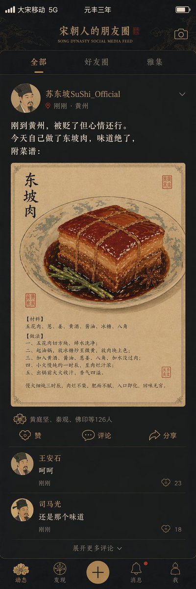</a>
<b>Song Dynasty Social Media Feed</b><br>
<sub>[原链接](https://opennana.com/awesome-prompt-gallery/song-dynasty-cyber-social-feed)</sub>
</td>
</tr>
</table>

## 再看 6 条

<table>
<tr>
<td width="50%" valign="top">
<a href="images/infographic/3d-stone-staircase-evolution-infographic.jpg"></a>
<b>3D Stone Staircase Evolution Infographic</b><br>
<sub>作者：[知识猫图解](https://x.com/GeekCatX) · [原链接](https://x.com/GeekCatX/status/2045792240044511277#reversed-1)</sub>
</td>
<td width="50%" valign="top">
<a href="images/infographic/illustrated-city-food-map.jpg">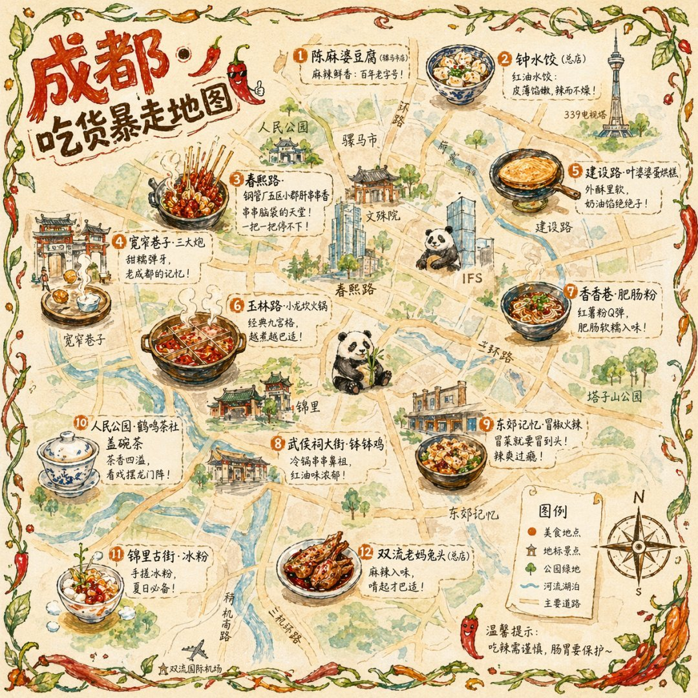</a>
<b>Illustrated City Food Map</b><br>
<sub>作者：[皮皮特](https://x.com/mm_zzm44854) · [原链接](https://x.com/mm_zzm44854/status/2045861258520568230#reversed-1)</sub>
</td>
</tr>
<tr>
<td width="50%" valign="top">
<a href="images/infographic/jingdezhen-blue-white-porcelain-diagram.jpeg">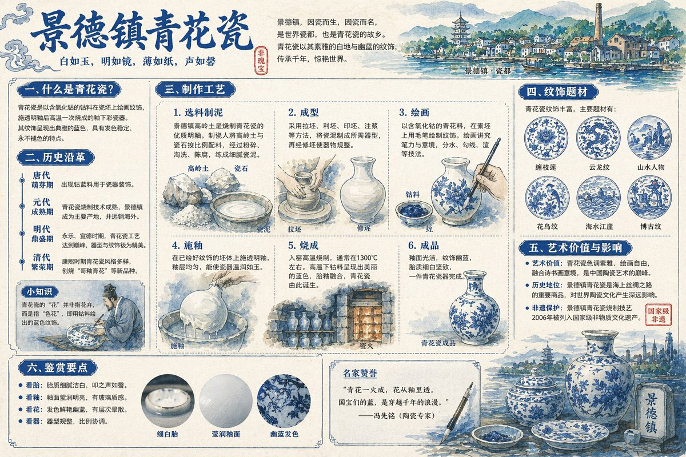</a>
<b>Jingdezhen Blue-and-White Porcelain Diagram</b><br>
<sub>[原链接](https://opennana.com/awesome-prompt-gallery/jingdezhen-blue-white-porcelain-diagram)</sub>
</td>
<td width="50%" valign="top">
<a href="images/infographic/key-character-relationship-map.jpeg"></a>
<b>Key Character Relationship Map</b><br>
<sub>[原链接](https://opennana.com/awesome-prompt-gallery/key-character-relationship-map)</sub>
</td>
</tr>
<tr>
<td width="50%" valign="top">
<a href="images/infographic/museum-level-chinese-disassembly-infographic.jpeg">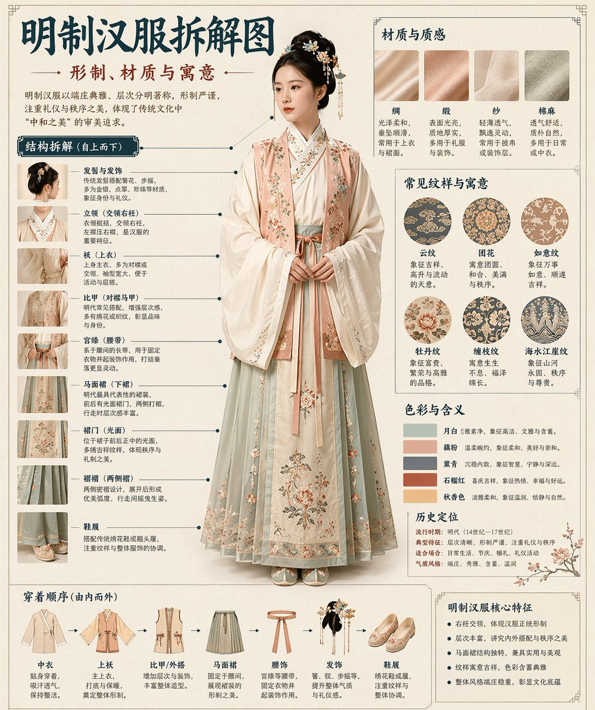</a>
<b>Museum Catalog-Style Chinese Disassembly Infographic</b><br>
<sub>[原链接](https://opennana.com/awesome-prompt-gallery/museum-level-chinese-disassembly-infographic)</sub>
</td>
<td width="50%" valign="top">
<a href="images/game/anime-martial-arts-battle-illustration.jpg"></a>
<b>Anime Martial Arts Battle Illustration</b><br>
<sub>作者：[たねもみ 2.0 / Tanemomi Ver2.0](https://x.com/Tanemomi_Ver2) · [原链接](https://x.com/Tanemomi_Ver2/status/2046063806846214265#reversed-0)</sub>
</td>
</tr>
</table>

---

## 海报 / Poster
<a id="poster"></a>

> 当前分类共 **6** 条

### Apple Park Keynote Crowd Shot
<p></p>
- 来源仓库：`ZeroLu/awesome-gpt-image`
- [原链接](https://opennana.com/awesome-prompt-gallery/apple-park-tim-cook-keynote)

**Prompt**
```text
Amateur iPhone photo at Apple Park during the iPhone 20 keynote, Tim Cook presenting on stage. Shot from the crowd at a distance
```

### VR Headset Exploded View Poster
<p></p>
- 来源仓库：`YouMind-OpenLab/awesome-gpt-image-2`
- 作者：[wory＠ホッピング中](https://x.com/wory37303852)
- [原链接](https://x.com/wory37303852/status/2045925660401795478#reversed-0)

**Prompt**
```text
{
  "type": "exploded view product diagram poster",
  "subject": "VR headset",
  "style": "clean high-tech 3D render, studio lighting, glowing accents",
  "background": "{argument name=\"background color\" default=\"soft purple and blue gradient\"}",
  "header": {
    "logo": "∞ {argument name=\"product name\" default=\"Meta Quest 3\"}",
    "subtitle": "{argument name=\"main catchphrase\" default=\"まったく新しい現実を、まったく新しい構造から。\"}"
  },
  "layout": {
    "centerpiece": "vertically stacked exploded view of a VR headset showing 9 distinct layers of internal components: outer shell, camera sensors, motherboard with chip, pancake lenses, internal frame, battery packs, side straps, top strap, and facial interface cushion.",
    "callout_labels": {
      "count": 8,
      "left_side": [
        "Snapdragon® XR2 Gen 2\n圧倒的な処理性能でリアルタイムな体験を。",
        "調整可能なIPD機構\n幅広いユーザーに快適なフィット感を。",
        "精密設計された...
```

### YouTube Thumbnail - VTuber Chat Stream Thumbnail
<p></p>
- 来源仓库：`YouMind-OpenLab/awesome-gpt-image-2`
- 作者：[絵愛さやか🐸AIArtist](https://x.com/sayaka_aiart)
- [原链接](https://x.com/sayaka_aiart/status/2046176145075515600#reversed-3)

**Prompt**
```text
{
  "type": "VTuber stream thumbnail",
  "style": "anime, highly detailed, cute, sparkly, overwhelmingly pink color palette",
  "character": {
    "description": "anime girl with brown hair in twin buns, amber eyes, smiling gently",
    "outfit": "pink kimono combined with a white frilly maid apron, cherry blossom hair accessories",
    "pose": "holding a pink microphone decorated with a flower near her face"
  },
  "layout": {
    "background": "pink gradient with sparkles, glowing hearts, and decorative pink bows",
    "text_sections": [
      {
        "type": "top ribbon",
        "text": "{argument name=\"top subtitle\" default=\"まったりおしゃべりしよ〜🤍\"}"
      },
      {
        "type": "main title",
        "text": "{argument name=\"main title\" default=\"雑談配信\"}",
        "decorations": "surrounded by 3 large peach illustrations"
      },
      {
        "type": "middle ribbon",
        ...
```

### YouTube Thumbnail - Flashy VTuber Debut Stream Thumbnail
<p></p>
- 来源仓库：`YouMind-OpenLab/awesome-gpt-image-2`
- 作者：[結パパ](https://x.com/Yuupapa_free)
- [原链接](https://x.com/Yuupapa_free/status/2044941300789887394#reversed-0)

**Prompt**
```text
A high-energy VTuber thumbnail illustration of a smiling anime girl with {argument name="hair color" default="bright blue"} hair in a high ponytail wearing a white shirt. The background is an explosive burst of rainbow light rays and golden sparkles. A golden retro microphone sits in the bottom left. Massive, shiny 3D gold text on the left reads "{argument name="main title text" default="初配信"}". A 3D gold and blue subtitle reads "{argument name="subtitle text" default="一緒に最高の時間を！"}". An ornate blue and gold oval badge in the bottom right displays "{argument name="character name" default="エリン Erin"}". A red top-right badge reads "{argument name="badge text" default="LIVE"}".
```

### YouTube Thumbnail - Influencer Live-streaming Scene
<p></p>
- 来源仓库：`YouMind-OpenLab/awesome-gpt-image-2`
- 作者：[underwood](https://x.com/underwoodxie96)
- [原链接](https://x.com/underwoodxie96/status/2044754351303045477)

**Prompt**
```text
{argument name="subject" default="A beautiful internet celebrity"} is live-streaming a {argument name="activity" default="game"}.
```

### YouTube Thumbnail - YouTube Unboxing Thumbnail Prompt
<p></p>
- 来源仓库：`YouMind-OpenLab/awesome-gpt-image-2`
- 作者：[とらの](https://x.com/TlanoAI)
- [原链接](https://x.com/TlanoAI/status/2044604299339247730)

**Prompt**
```text
Thumbnail for a YouTube unboxing video, a video of {argument name="topic" default="opening all overdue bills"}, {argument name="quantity" default="100 in a row"}
```

---

## UI / 界面
<a id="ui"></a>

> 当前分类共 **57** 条

### Custom Style UI Design System
<p></p>
- 来源仓库：`ZeroLu/awesome-gpt-image`
- [原链接](https://opennana.com/awesome-prompt-gallery/custom-style-ui-system)

**Prompt**
```text
Generate a UI design system for me in xx style, including web pages, mobile, cards, controls, buttons, and others
```

### Douyin Livestream Screenshot
<p></p>
- 来源仓库：`ZeroLu/awesome-gpt-image`
- [原链接](https://opennana.com/awesome-prompt-gallery/liu-yifei-douyin-live-chat)

**Prompt**
```text
9:16 aspect ratio, generate a screenshot of a Douyin live stream, inside is Liu Yifei live streaming, Liu Yifei is holding a sign in her hand, the sign says Tonight's live stream, welcome to join Yifei for a chat!
```

### E-commerce Live Stream UI Mockup
<p></p>
- 来源仓库：`YouMind-OpenLab/awesome-gpt-image-2`
- 作者：[神经病不想好转](https://x.com/sjbbxhz)
- [原链接](https://x.com/sjbbxhz/status/2045684734714380687#reversed-0)

**Prompt**
```text
{
  "type": "live stream UI mockup",
  "subject": {
    "description": "portrait of {argument name=\"host name\" default=\"Elon Musk\"}, smiling, wearing a black t-shirt with a white technical schematic graphic",
    "background": "left side shows a screen with '{argument name=\"left background logo\" default=\"SPACEX\"}' text, right side shows a red '{argument name=\"right background logo\" default=\"Tesla T logo\"}' and a dark car"
  },
  "ui_overlay": {
    "top_header": {
      "host_info": "avatar, name '{argument name=\"host name\" default=\"Elon Musk\"}', subtext '55.6万本场点赞', red '关注' button",
      "rank_badge": "gold coin icon with '全站第1名'",
      "viewer_stats": "3 top viewer avatars with '12.3w', '8.6w', '5.7w', total '68.7万', 'X' close button",
      "right_links": "'更多直播 >', '礼物展馆 0/24' with blue '经典' tag"
    },
    "mid_left_gifts": {
      "count": 2,
      "items": [
   ...
```

### Song Dynasty Social Media Feed
<p></p>
- 来源仓库：`ZeroLu/awesome-gpt-image`
- [原链接](https://opennana.com/awesome-prompt-gallery/song-dynasty-cyber-social-feed)

**Prompt**
```text
"Song Dynasty People's Moments"/"SONG DYNASTY SOCIAL MEDIA FEED", Ancient and modern time-travel humor fusion interface design style, The image simulates a mobile phone social media interface, but the content is entirely Song Dynasty scenes, The avatar is a portrait of a Song Dynasty literati, Username "Su Dongpo SuShi_Official", Post content "Just arrived in Huangzhou, demoted but feeling okay. Made Dongpo pork myself today, tastes amazing, recipe attached:", The attached image is a close-up of Dongpo pork in Gongbi painting style, Likes list "Huang Tingjian, Qin Guan, Fo Yin etc. 126 people", Comments section "Wang Anshi: Hehe" "Sima Guang: Still the same taste", Interface elements such as the like icon are replaced with Song Dynasty patterns, The status bar shows "Great Song Mobile 5G" and "Third Year of Yuanfeng", The color scheme is mobile phone dark mode paired with elegant Song Dy...
```

### Profile / Avatar - 4-Panel Professional Avatar Grid
<p>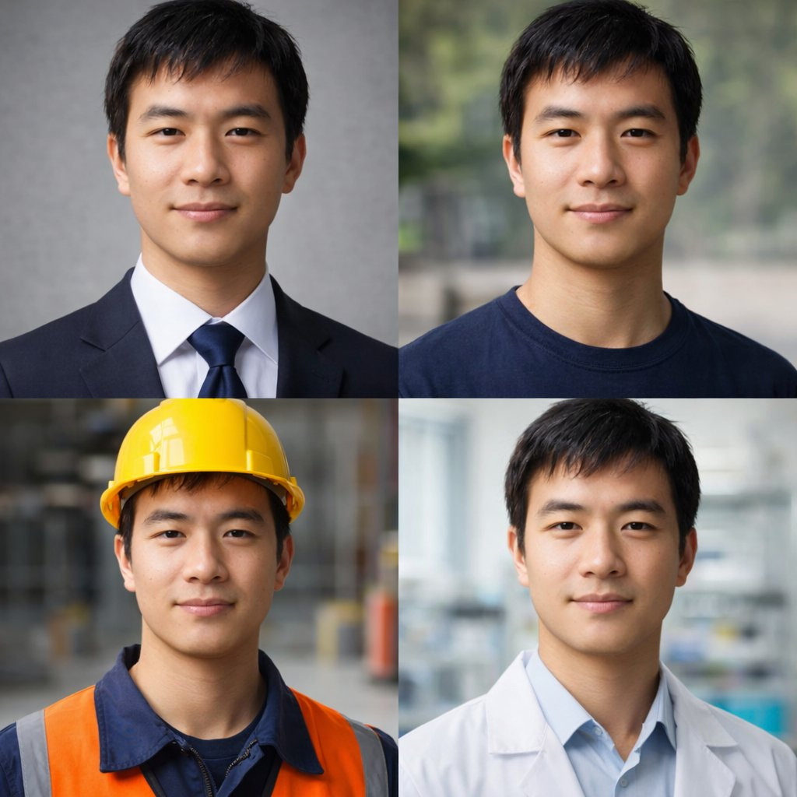</p>
- 来源仓库：`YouMind-OpenLab/awesome-gpt-image-2`
- 作者：[observer2026](https://x.com/frankfu1688)
- [原链接](https://x.com/frankfu1688/status/2046171263648080364#reversed-0)

**Prompt**
```text
{
  "type": "2x2 portrait grid",
  "subject": "{argument name=\"subject description\" default=\"young adult East Asian male with short black hair and a slight smile\"}",
  "style": "photorealistic, high-resolution, professional lighting, consistent facial identity across all panels",
  "layout": {
    "format": "2x2 grid",
    "panel_count": 4,
    "panels": [
      {
        "position": "top-left",
        "description": "{argument name=\"profession 1\" default=\"Corporate professional wearing a dark navy suit, white shirt, and blue tie against a gray textured background\"}"
      },
      {
        "position": "top-right",
        "description": "{argument name=\"profession 2\" default=\"Casual attire wearing a dark blue crew neck t-shirt against a blurred outdoor park background\"}"
      },
      {
        "position": "bottom-left",
        "description": "{argument name=\"profession...
```

### Profile / Avatar - Goth Style Transformation
<p></p>
- 来源仓库：`YouMind-OpenLab/awesome-gpt-image-2`
- 作者：[daniel.dmai](https://x.com/danieldmai)
- [原链接](https://x.com/danieldmai/status/2046170898118435090#reversed-1)

**Prompt**
```text
Using REFERENCE_0, transform the subject's appearance to a {argument name="style" default="trad goth"} aesthetic while preserving the exact pose, clothing structure, and background. Change her hair to {argument name="hair color" default="black"} with {argument name="hair style" default="choppy bangs"}. Apply heavy dark makeup, specifically {argument name="lip color" default="black"} lipstick and intense dark eyeshadow, and make her skin tone slightly paler. Add 2 facial piercings: a septum ring and a nostril stud. Finally, modify her layered necklaces to feature {argument name="necklace pendants" default="an inverted cross and a pentagram"}.
```

### Profile / Avatar - Graffiti Sketch AI Builder Style
<p>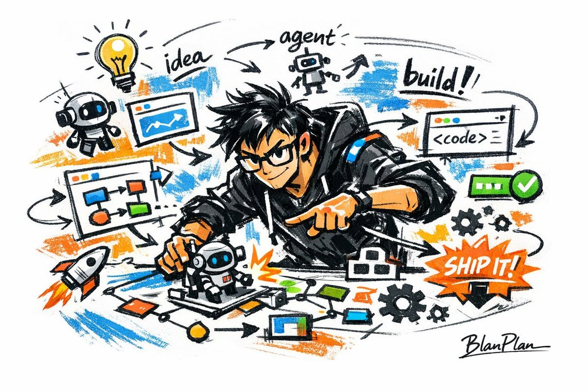</p>
- 来源仓库：`YouMind-OpenLab/awesome-gpt-image-2`
- 作者：[Mutedmen](https://x.com/opc_8838)
- [原链接](https://x.com/opc_8838/status/2046162334440448339)

**Prompt**
```text
Express [{argument name="subject" default="a powerful AI builder"}] in a graffiti sketch style, presenting an overall visual effect of rapid sketching, free transformation, improvised hand-drawing, and draft-like qualities. Lines are casual, exaggerated, varied in thickness, slightly messy but rhythmic and expressive, emphasizing generalization, exaggeration, fun, and spontaneity rather than rigorous realism or fine detail. Colors use rough, dry-brush block expressions, retaining uneven smears, brush marks, flying whites, and overlapping feelings. Colors automatically adapt to the [theme/subject], but the overall expression remains graffiti-like, sketch-like, and generalized. No transparent watercolor smudging, no delicate watercolor transitions, no paper textures, no soft atomization, and no dreamlike quality. The background is mainly white space, remaining simple, relaxed, unfinished, ...
```

### Profile / Avatar - 3D Animated Character Expression Grid
<p></p>
- 来源仓库：`YouMind-OpenLab/awesome-gpt-image-2`
- 作者：[Austin](https://x.com/austinit)
- [原链接](https://x.com/austinit/status/2046025895941750868#reversed-0)

**Prompt**
```text
{
  "type": "3x3 character expression grid",
  "style": "{argument name=\"art style\" default=\"3D animation, Pixar style\"}",
  "character_base": "{argument name=\"character description\" default=\"young woman with voluminous dark wavy hair and round wire-rimmed glasses\"}",
  "common_theme": "{argument name=\"framing concept\" default=\"peeking through a torn hole in white paper\"}",
  "layout": {
    "rows": 3,
    "columns": 3,
    "total_panels": 9,
    "panels": [
      {"position": "top-left", "expression": "winking", "action": "adjusting glasses", "outfit": "green sweater"},
      {"position": "top-center", "expression": "smirking", "action": "lowering dark sunglasses", "outfit": "red leather jacket"},
      {"position": "top-right", "expression": "thinking", "action": "finger on chin", "outfit": "yellow hoodie"},
      {"position": "middle-left", "expression": "big smile", "acti...
```

### Profile / Avatar - Kawaii 3D Character Icon
<p>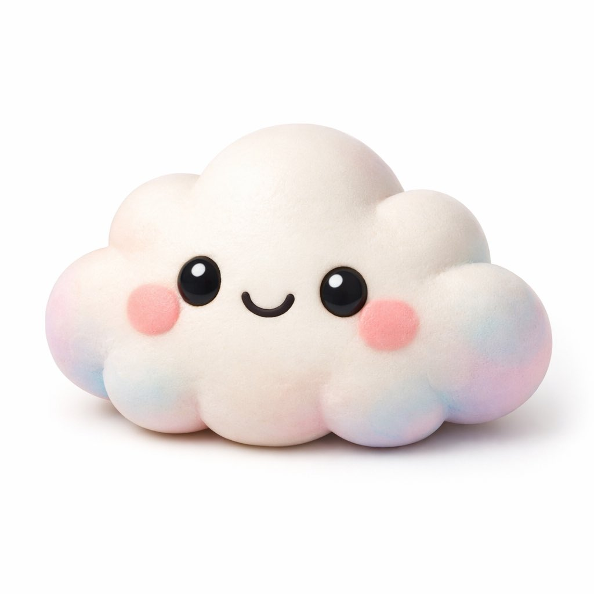</p>
- 来源仓库：`YouMind-OpenLab/awesome-gpt-image-2`
- 作者：[Yuru](https://x.com/yurunekofree)
- [原链接](https://x.com/yurunekofree/status/2046016054305145102#reversed-0)

**Prompt**
```text
A 3D render of a cute kawaii {argument name="subject" default="cloud"} character on a pure white background. The character has a soft, matte, squishy texture resembling clay or a stress toy. It features large glossy black eyes with white highlights, a simple curved smile, and round pink blush on its cheeks. The edges and bottom of the figure have a subtle pastel gradient of {argument name="accent colors" default="pink, blue, and purple"}. Soft studio lighting, minimalist icon style, casting a gentle shadow.
```

### Profile / Avatar - Quirky Animal Sticker Set
<p></p>
- 来源仓库：`YouMind-OpenLab/awesome-gpt-image-2`
- 作者：[みどり🐲Midori Tatsuta](https://x.com/midori_tatsuta)
- [原链接](https://x.com/midori_tatsuta/status/2045367592353943984)

**Prompt**
```text
Create {argument name="quantity" default="24"} LINE stickers of {argument name="animals" default="animals"} in a quirky hand-drawn style. Target {argument name="target audience" default="Japanese Gen Z"} with a trendy style that can aim for top downloads.
```

### Profile / Avatar - VTuber Profile Sheet Generator
<p></p>
- 来源仓库：`YouMind-OpenLab/awesome-gpt-image-2`
- 作者：[WTR](https://x.com/wtry1102)
- [原链接](https://x.com/wtry1102/status/2045270824542953673#reversed-0)

**Prompt**
```text
{ "type": "VTuber profile sheet", "theme": "{argument name=\"color theme\" default=\"purple and white\"}, elegant, lace, ribbon motifs", "character": { "name": "{argument name=\"character name\" default=\"紫咲リリー\"}", "archetype": "{argument name=\"character archetype\" default=\"elegant ojousama\"}", "appearance": "anime girl, long black hair with purple highlights, purple eyes, wearing a white blazer, purple pleated skirt, thigh-highs, ribbons", "pose": "standing, finger to lips, looking slightly to the side" }, "chibi_character": { "appearance": "same character in chibi form", "pose": "sitting down, smiling" }, "layout": { "header": { "top_left": "Ribbon banner reading 'VTuber Profile'", "top_center": "Logo with text '{argument name=\"vtuber type\" default=\"清楚系お嬢様Vtuber\"}' and '{argument name=\"character name\" default=\"紫咲リリー\"}' and 'Shisaki Lily'", "top_right": "Quote '{argument na...
```

### Profile / Avatar - Graffiti Sketch Style AI Builder
<p></p>
- 来源仓库：`YouMind-OpenLab/awesome-gpt-image-2`
- 作者：[BLANPLAN | 空界計劃](https://x.com/blanplan)
- [原链接](https://x.com/blanplan/status/2045190582453350748)

**Prompt**
```text
Express {argument name="subject" default="a powerful AI builder"} in a graffiti sketch style, presenting an overall visual effect of quick outlines, free deformation, improvised hand-drawing, and draft-like sketches. The lines are casual, exaggerated, varying in thickness, and slightly messy but rhythmic and expressive, emphasizing generalization, exaggeration, fun, and spontaneity rather than rigorous realism or fine detail. The colors are expressed in rough blocks with a distinct dry-brush feel, retaining uneven smears, brush marks, fly-white, and layering. Colors automatically adapt to the {argument name="theme" default="powerful AI builder"}, but the overall expression remains graffiti-like, sketch-like, and generalized. No transparent watercolor smudging effects, no delicate watercolor transitions, no paper textures, no soft atomization, and no dreamy textures. The background is mai...
```

### Social Media Post - 4-Panel Japanese Digital Ad Banner Grid
<p></p>
- 来源仓库：`YouMind-OpenLab/awesome-gpt-image-2`
- 作者：[まかねこ| AI×仮想通貨](https://x.com/makaneko_AI)
- [原链接](https://x.com/makaneko_AI/status/2045764016858087720#reversed-0)

**Prompt**
```text
{
  "type": "2x2 grid of Japanese digital advertisement banners",
  "layout": {
    "structure": "4 equal quadrants",
    "quadrants": [
      {
        "position": "top-left",
        "theme": "Travel",
        "subject": "A couple holding hands on a white sand beach, looking out at turquoise ocean water under a bright blue sky.",
        "elements": ["red hibiscus flower in bottom left corner"],
        "text_labels": [
          "今年こそ、解き放て。",
          "{argument name=\"travel destination\" default=\"沖縄旅行\"}",
          "3日間の癒やし旅",
          "航空券＋ホテル",
          "39,800円〜",
          "絶景、グルメ、体験 ぜんぶ叶う!"
        ],
        "icons": {
          "count": 3,
          "descriptions": ["airplane", "hotel building", "car"]
        }
      },
      {
        "position": "top-right",
        "theme": "Skincare",
        "subject": "Close-up portrait of a young woman with glowing, dewy skin, ey...
```

### Social Media Post - Douyin Livestream Screenshot Prompt
<p></p>
- 来源仓库：`YouMind-OpenLab/awesome-gpt-image-2`
- 作者：[Kyle 不写代码](https://x.com/kylegeeks)
- [原链接](https://x.com/kylegeeks/status/2046479783765397629)

**Prompt**
```text
A 9:16 aspect ratio image, generating a screenshot of a Douyin livestream where {argument name="celebrity" default="Liu Yifei"} is broadcasting, holding a sign that says "{argument name="sign text" default="Streaming tonight, welcome to join Yifei's chat!"}"
```

### Social Media Post - 7-Day Fashion Lookbook Infographic
<p>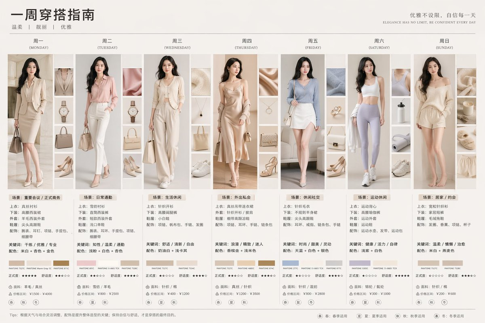</p>
- 来源仓库：`YouMind-OpenLab/awesome-gpt-image-2`
- 作者：[沐阳](https://x.com/yyyole)
- [原链接](https://x.com/yyyole/status/2046469645155303730#reversed-0)

**Prompt**
```text
{
  "type": "7-day fashion lookbook infographic",
  "header": {
    "title": "{argument name=\"main title\" default=\"一周穿搭指南\"}",
    "subtitle": "{argument name=\"style keywords\" default=\"温柔 | 靓丽 | 优雅\"}",
    "slogan_cn": "优雅不设限，自信每一天",
    "slogan_en": "{argument name=\"english slogan\" default=\"ELEGANCE HAS NO LIMIT, BE CONFIDENT EVERY DAY\"}"
  },
  "subject": "{argument name=\"subject description\" default=\"young elegant Asian woman\"}",
  "layout": {
    "columns": 7,
    "column_elements": [
      "day_header",
      "main_portrait",
      "4_detail_thumbnails",
      "outfit_specs",
      "keywords_colors",
      "3_color_swatches",
      "star_ratings",
      "fabric_price",
      "4_season_icons"
    ],
    "days": [
      { "day": "周一 (MONDAY)", "outfit": "beige blazer suit", "scene": "场景：重要会议 / 正式商务" },
      { "day": "周二 (TUESDAY)", "outfit": "pink blazer suit", "scene"...
```

### Social Media Post - Vintage Arcade Repair Flash Photography
<p></p>
- 来源仓库：`YouMind-OpenLab/awesome-gpt-image-2`
- 作者：[nic](https://x.com/nicdunz)
- [原链接](https://x.com/nicdunz/status/2046306963605352841#reversed-3)

**Prompt**
```text
A vintage, late 90s amateur flash photograph of a young man repairing an arcade machine. He is kneeling on a dark, patterned arcade carpet, looking back over his shoulder directly at the camera with a neutral expression. He wears a dark short-sleeved t-shirt, baggy blue jeans, chunky white sneakers, and a dark baseball cap. The lower front panel of the arcade cabinet is wide open, exposing its complex internal electronics, including a tangle of wires, green circuit boards, a large speaker, and metal cooling fans at the base. The side of the cabinet features vibrant pink, black, and white graphics with the text "{argument name="arcade game title" default="Dancing Stage"}" and the brand "{argument name="arcade brand" default="KONAMI"}". The setting is a dimly lit arcade interior with other glowing game cabinets visible in the blurred background. A screwdriver lies on the carpet near the ma...
```

### Social Media Post - Food Recipe Flowchart Prompt
<p></p>
- 来源仓库：`YouMind-OpenLab/awesome-gpt-image-2`
- 作者：[Peng](https://x.com/Kurt_Rousey466)
- [原链接](https://x.com/Kurt_Rousey466/status/2046267707881029934)

**Prompt**
```text
Help me create a detailed production flowchart for the dish {argument name="dish name" default="Fried Pork with Chili"}, in a realistic style, suitable for Xiaohongshu image-text proportions.
```

### Social Media Post - Historical Figure Social Media Mockup
<p>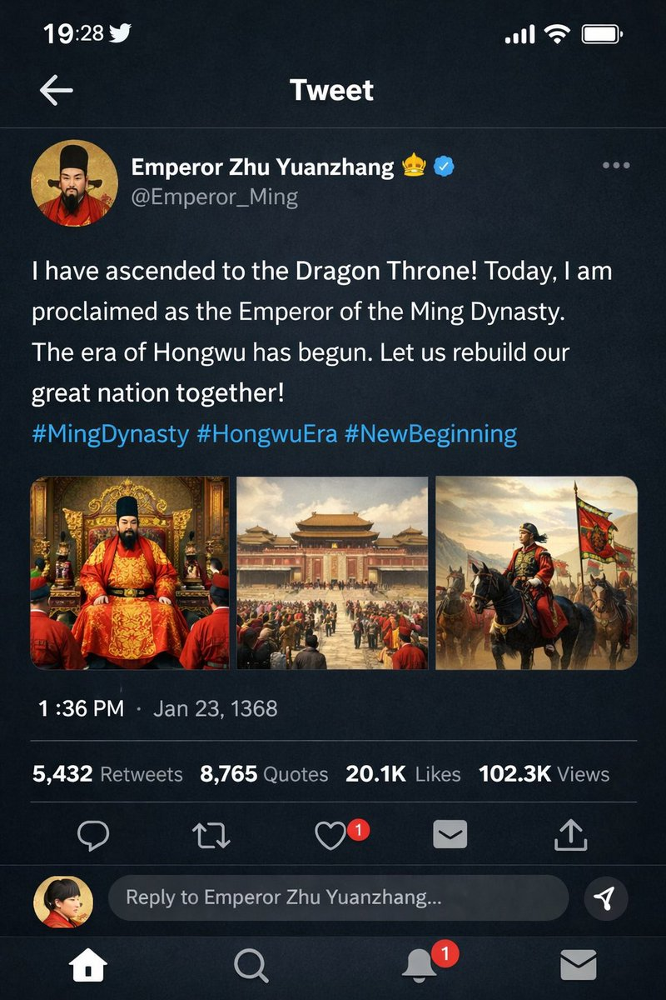</p>
- 来源仓库：`YouMind-OpenLab/awesome-gpt-image-2`
- 作者：[李岳](https://x.com/liyue_ai)
- [原链接](https://x.com/liyue_ai/status/2046245319973949816#reversed-0)

**Prompt**
```text
{
  "type": "mobile social media app UI mockup",
  "platform": "Twitter/X dark mode",
  "header": {
    "status_bar": "time 19:28, bird icon, signal, wifi, battery",
    "navigation": "back arrow, 'Tweet' title"
  },
  "post": {
    "author": {
      "avatar": "portrait of a Chinese emperor in red robes and black hat",
      "display_name": "{argument name=\"display name\" default=\"Emperor Zhu Yuanzhang\"} 👑 [verified badge]",
      "handle": "{argument name=\"handle\" default=\"@Emperor_Ming\"}"
    },
    "content": {
      "text": "{argument name=\"tweet text\" default=\"I have ascended to the Dragon Throne! Today, I am proclaimed as the Emperor of the Ming Dynasty. The era of Hongwu has begun. Let us rebuild our great nation together!\"}",
      "hashtags": "#MingDynasty #HongwuEra #NewBeginning",
      "media_grid": {
        "count": 3,
        "images": [
          "emperor seate...
```

### Social Media Post - Oriental Fantasy City Poster
<p></p>
- 来源仓库：`YouMind-OpenLab/awesome-gpt-image-2`
- 作者：[李岳](https://x.com/liyue_ai)
- [原链接](https://x.com/liyue_ai/status/2046243132774494607)

**Prompt**
```text
Flat illustration, high-end oriental fantasy style city poster design, vertical 9:16 composition. The layout uses a diagonal + S-shaped flow extending from the bottom left to top right. The background is deep black grading down to intense dark red, creating strong warm-cool contrast and spatial depth with faint stardust and grain texture. In the center, a flowing golden energy line winds through like a flame, extending upward from the base, featuring fluid texture, particle effects, and gradient highlights, with subtle energy debris and volumetric light.

Within the golden flow, the architectural landmarks of {argument name="city" default="Guangzhou"} emerge layer by layer: the Canton Tower is the visual core with prominent proportions, surrounded by the Zhujiang New Town skyline, Liede Bridge, and modern Lingnan architectural elements. Buildings are rendered using "fine line drawing + g...
```

### Social Media Post - 3D Cinematic Multi-Panel Promo Poster
<p>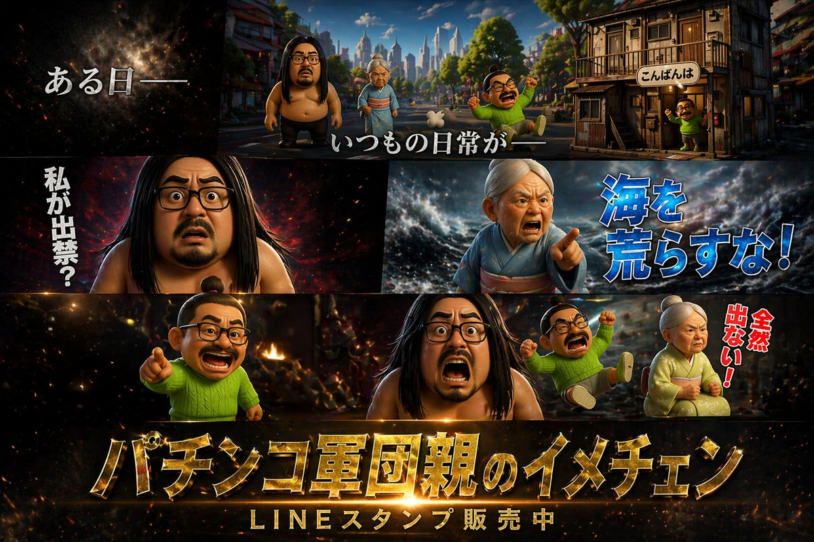</p>
- 来源仓库：`YouMind-OpenLab/awesome-gpt-image-2`
- 作者：[運良杉金助（うんよすぎきんすけ）](https://x.com/X64zzotSKCGtYmt)
- [原链接](https://x.com/X64zzotSKCGtYmt/status/2046238165158240449#reversed-0)

**Prompt**
```text
{
  "type": "cinematic promotional poster",
  "style": "3D CGI animation style, highly detailed, dramatic lighting, caricature characters",
  "characters": [
    { "id": "char1", "description": "large shirtless man with long black hair, beard, and glasses" },
    { "id": "char2", "description": "elderly woman in a kimono with white hair tied up" },
    { "id": "char3", "description": "small man with a topknot, glasses, mustache, wearing a bright green sweater" }
  ],
  "layout": {
    "panels": [
      {
        "position": "top",
        "scene": "wide shot of a town street with buildings and a city skyline in the background",
        "characters_present": ["char1", "char2", "char3"],
        "text_overlays": [
          "{argument name=\"intro text\" default=\"ある日ーー\"}",
          "いつもの日常がーー",
          "こんばんは"
        ]
      },
      {
        "position": "middle left",
        "scen...
```

### Social Media Post - 5-Panel Mixed Style Collage
<p>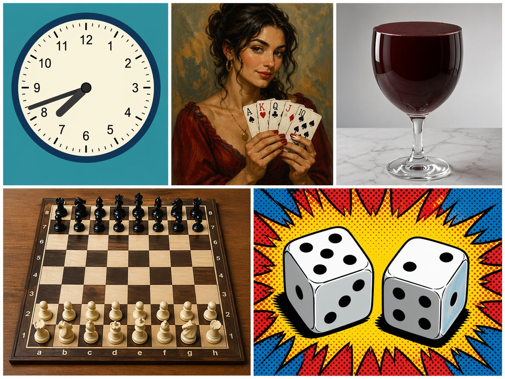</p>
- 来源仓库：`YouMind-OpenLab/awesome-gpt-image-2`
- 作者：[pozitiv4ik](https://x.com/Gc_qube)
- [原链接](https://x.com/Gc_qube/status/2046205568474403194#reversed-2)

**Prompt**
```text
{
  "type": "5-panel collage",
  "layout": "grid with 3 top panels and 2 bottom panels",
  "panels": [
    {
      "position": "top-left",
      "subject": "analog clock",
      "details": "teal background, time showing {argument name=\"clock time\" default=\"7:42\"}",
      "style": "flat vector illustration"
    },
    {
      "position": "top-middle",
      "subject": "woman holding playing cards",
      "details": "holding 5 cards: {argument name=\"card hand\" default=\"Ace of Spades, King of Hearts, Queen of Clubs, Jack of Diamonds, 10 of Spades\"}",
      "style": "classic oil painting portrait"
    },
    {
      "position": "top-right",
      "subject": "glass of red liquid",
      "details": "{argument name=\"glass type\" default=\"wine glass\"} filled to the brim with dark red liquid, marble surface",
      "style": "photorealistic studio photography"
    },
    {
      "positi...
```

### Social Media Post - 2x2 Grid of Online School Banner Ads
<p></p>
- 来源仓库：`YouMind-OpenLab/awesome-gpt-image-2`
- 作者：[パク🎈動画広告分析Pro × AI](https://x.com/masapark95)
- [原链接](https://x.com/masapark95/status/2046171479763828888#reversed-2)

**Prompt**
```text
{
  "type": "2x2 grid of banner advertisements",
  "theme": "{argument name=\"main theme\" default=\"SNSスクール\"} for {argument name=\"target audience\" default=\"ママ\"}",
  "design_style": "soft, approachable, bright lighting, featuring {argument name=\"color palette\" default=\"soft green, white, and natural beige tones\"}",
  "layout": {
    "sections": [
      {
        "position": "top-left",
        "visual_style": "photography",
        "image_description": "Smiling woman working on a laptop at a table, a toddler playing with toys in the blurred background.",
        "headlines": ["ママの“やってみたい”を応援！", "子育てしながら学べる", "SNSスクール"],
        "features": {
          "count": 1,
          "type": "icon with text",
          "labels": ["自宅で無理なくスキルアップ (with house icon)"]
        },
        "call_to_action_button": "無料相談"
      },
      {
        "position": "top-right",
        "visual_style": "p...
```

### Infographic / Edu Visual - Eastern Mythology Infographic Manuscript
<p>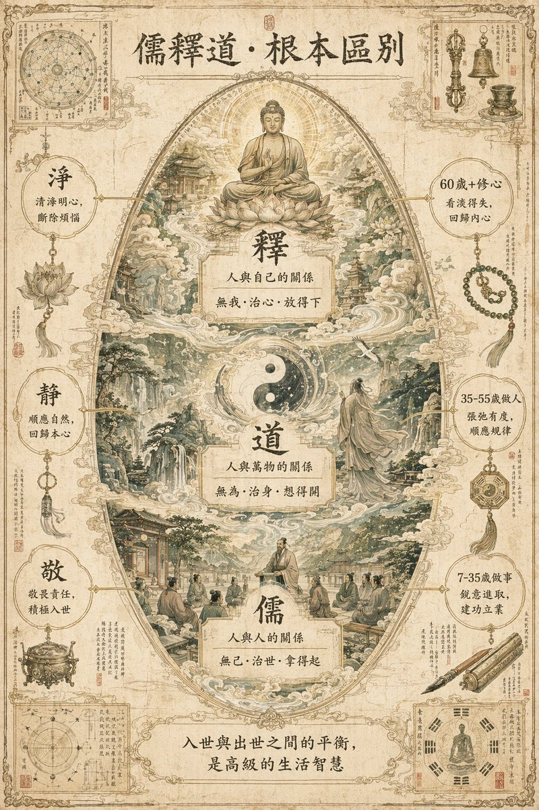</p>
- 来源仓库：`YouMind-OpenLab/awesome-gpt-image-2`
- 作者：[知识猫图解](https://x.com/GeekCatX)
- [原链接](https://x.com/GeekCatX/status/2046477494979793046)

**Prompt**
```text
A breathtaking and extremely complex world-building infographic masterpiece conceptualizing the "{argument name="theme" default="Fundamental Differences between Confucianism, Buddhism, and Taoism"}", designed as a profound {argument name="style" default="ancient Oriental mythological manuscript"}.
Background: Pure white vintage textured canvas with a light beige aged parchment base color, subtle frayed edges, and water stain textures.
Core Layout: Central vision uses a grand "vertical egg-shaped layered structure", with Buddhism, Taoism, and Confucianism layers from top to bottom.
Margins: Four corners are decorated with fine micro-illustrations featuring ancient observation notes, ritual implements, and runes.
Colors: Low-saturation sage green, light gold, and off-white as main tones; overall light and soft without harsh high-saturation colors.
Details: Architectural lines, landscape br...
```

### Infographic / Edu Visual - Fashion Design Process Infographic
<p></p>
- 来源仓库：`YouMind-OpenLab/awesome-gpt-image-2`
- 作者：[虎小象](https://x.com/hx831126)
- [原链接](https://x.com/hx831126/status/2046454226080219281#reversed-3)

**Prompt**
```text
{
  "type": "fashion design process infographic",
  "title": "{argument name=\"main title\" default=\"一件女装诞生的因果链 THE CAUSAL CHAIN OF A WOMEN'S GARMENT\"}",
  "subtitle": "从纤维，到版型，到上身 FROM FIBER TO FIT",
  "style": {
    "aesthetic": "elegant editorial, technical fashion illustration, highly detailed",
    "color_palette": "{argument name=\"color palette\" default=\"beige, cream, and neutral tones\"}"
  },
  "layout": {
    "centerpiece": {
      "description": "Exploded-view illustration of a {argument name=\"garment type\" default=\"women's trench coat dress\"} showing cascading layers of fabric, pattern pieces, and stitching lines. Top shows a model wearing the finished garment.",
      "central_list": {
        "count": 13,
        "type": "numbered steps with pointer lines",
        "labels": ["01 Material", "02 Inspiration", "03 Sketch", "04 Fabric", "05 Draping", "06 Pattern", "07 ...
```

### Infographic / Edu Visual - Camera Exploded View Infographic
<p></p>
- 来源仓库：`YouMind-OpenLab/awesome-gpt-image-2`
- 作者：[虎小象](https://x.com/hx831126)
- [原链接](https://x.com/hx831126/status/2046448092871041500#reversed-3)

**Prompt**
```text
{
  "type": "technical infographic",
  "subject": "{argument name=\"subject matter\" default=\"digital photography process\"}",
  "header": {
    "title": "{argument name=\"main title\" default=\"一张照片诞生的因果链 THE CAUSAL CHAIN OF A PHOTOGRAPH\"}",
    "subtitle": "从世界，到图像 FROM WORLD TO IMAGE"
  },
  "centerpiece": {
    "description": "Exploded isometric view of a modern mirrorless camera",
    "model": "{argument name=\"camera model\" default=\"Canon EOS R5\"}",
    "labeled_parts_count": 12,
    "labeled_parts": [
      "EVF",
      "Body Structure",
      "Control Dials",
      "Thermal Design",
      "Optical Axis",
      "IBIS Stabilizer",
      "Shutter Unit",
      "Full-Frame Sensor",
      "{argument name=\"processor name\" default=\"DIGIC X Processor\"}",
      "Main PCB",
      "High-Speed Bus",
      "Card Slot"
    ]
  },
  "layout": {
    "left_column": {
      "description": ...
```

### Infographic / Edu Visual - Camera Exploded View Infographic
<p></p>
- 来源仓库：`YouMind-OpenLab/awesome-gpt-image-2`
- 作者：[虎小象](https://x.com/hx831126)
- [原链接](https://x.com/hx831126/status/2046448092871041500#reversed-2)

**Prompt**
```text
{
  "type": "technical infographic and exploded view diagram",
  "header": {
    "title": "{argument name=\"main title\" default=\"佳能 EOS R5 成像系统剖面 CANON EOS R5 IMAGING ATLAS\"}",
    "subtitles": [
      "一张照片是如何被制造出来的 HOW AN IMAGE IS ACTUALLY FORMED",
      "从光，到数据 | FROM PHOTONS TO FILES",
      "相机不是壳体，而是一条运算链 A camera is not a shell, but a computational chain"
    ],
    "top_left_box": {
      "title": "EOS R5 核心规格 KEY SPECIFICATIONS",
      "bullet_points_count": 6
    },
    "top_right_images": {
      "count": 2,
      "description": "front and back views of the camera body"
    }
  },
  "centerpiece": {
    "description": "highly detailed 3D exploded view of the {argument name=\"camera model\" default=\"Canon EOS R5\"} camera, showing internal components separated vertically",
    "components_visible": [
      "lens mount",
      "lens elements with glowing blue light rays",
  ...
```

### Infographic / Edu Visual - Botanical Growth Atlas Infographic
<p></p>
- 来源仓库：`YouMind-OpenLab/awesome-gpt-image-2`
- 作者：[虎小象](https://x.com/hx831126)
- [原链接](https://x.com/hx831126/status/2046448092871041500#reversed-1)

**Prompt**
```text
{
  "type": "scientific botanical infographic poster",
  "subject": "{argument name=\"plant species\" default=\"Pomegranate (Punica granatum)\"}",
  "style": "vintage botanical illustration mixed with modern infographic design, highly detailed, {argument name=\"color palette\" default=\"earthy greens, deep reds, parchment background\"}",
  "header": {
    "main_title": "{argument name=\"main title\" default=\"植物生命路径剖面\"}",
    "english_title": "{argument name=\"english title\" default=\"BOTANICAL GROWTH ATLAS\"}",
    "subtitle": "从种子到果实，一株植物如何展开自己 / FROM SEED TO FRUIT"
  },
  "centerpiece": "full plant showing extensive root system, woody stem, green leaves, blooming red flowers, and ripe fruits including one halved to show seeds",
  "layout": {
    "numbered_sections": [
      { "number": 1, "title": "种子结构 / Seed Architecture", "content": "cross-section of a single seed with 6 labeled ...
```

### Infographic / Edu Visual - 3D Urban Systems Atlas Infographic
<p></p>
- 来源仓库：`YouMind-OpenLab/awesome-gpt-image-2`
- 作者：[虎小象](https://x.com/hx831126)
- [原链接](https://x.com/hx831126/status/2046448092871041500#reversed-0)

**Prompt**
```text
{
  "type": "complex urban systems atlas infographic",
  "style": "{argument name=\"color palette\" default=\"dark background with glowing blue, gold, and purple accents\"}, highly detailed technical illustration, 3D isometric cutaway",
  "header": {
    "title": "{argument name=\"chinese city name\" default=\"上海\"}城市系统剖面 {argument name=\"english city name\" default=\"SHANGHAI\"} URBAN SYSTEMS ATLAS",
    "subtitles": [
      "地表之上，是城市；地表之下，是秩序 {argument name=\"english subtitle\" default=\"Beneath the skyline lies the machine.\"}",
      "一座城市如何运转 How a Megacity Actually Works"
    ]
  },
  "layout": {
    "top_left": "Compass rose and city map labeled '上海市域位置 SHANGHAI LOCATION'",
    "top_right": "Data table titled '城市数据 CITY DATA' with 7 rows of statistics",
    "centerpiece": {
      "description": "{argument name=\"centerpiece style\" default=\"highly detailed 3D isometric cutaway re...
```

### Infographic / Edu Visual - Encyclopedia Style Infographic Generator
<p></p>
- 来源仓库：`YouMind-OpenLab/awesome-gpt-image-2`
- 作者：[阿兰AI](https://x.com/alanlovelq)
- [原链接](https://x.com/alanlovelq/status/2046378199681257920)

**Prompt**
```text
Please generate a high-quality vertical "Popular Science Encyclopedia Image" based on {argument name="theme" default="animals"}.

This image is not a regular poster or a simple illustration, but a modular popular science infographic that possesses a sense of "illustration book, encyclopedia, information structure, and collectability." The overall style should reference a combination of high-end natural history illustrations, modern encyclopedia pages, lifestyle knowledge cards, and highly shareable social media infographics.

Please include in the frame:
- A clear and beautiful main visual of the subject
- Several magnified details of local characteristics
- Multiple rounded modular information sections
- Clear title hierarchies and key labels
- Concise yet rich encyclopedic content
- Visual ratings, key point summaries, or Top 5 modules

Content columns should be automatically adapted b...
```

### Infographic / Edu Visual - Pose and Lighting Analysis Sheet Transformer
<p></p>
- 来源仓库：`YouMind-OpenLab/awesome-gpt-image-2`
- 作者：[🪷青春ログアウト㊗️100万回再生▶️🌻](https://x.com/WOZ1Tx2JZ3kCeBj)
- [原链接](https://x.com/WOZ1Tx2JZ3kCeBj/status/2046343828739911683)

**Prompt**
```text
[CORE TASK]
Transform the provided input image into a pose-and-light analysis sheet.

This is NOT a finished character illustration.
This is NOT a clothing sheet.
This is NOT a beauty-preserving redraw.

This is a white-line rough mannequin conversion.

[PRIMARY GOAL]
Extract and visualize only:
- pose structure
- body balance
- camera angle
- body line flow
- inferred light source placement
- illuminated areas and light intensity

[INPUT ROLE]
Use the provided image as the strict anchor for:
- pose
- camera angle
- body tilt
- weight distribution
- approximate lighting situation

Do NOT preserve:
- face rendering
- hairstyle rendering
- clothing detail
- accessories
- weapon detail
- background architecture
- character identity
- emotional expression

[FIGURE CONVERSION]
single rough mannequin-like human figure
white body contour lines
white internal construction lines
simple mannequin ...
```

### Infographic / Edu Visual - Optical Hardware Setup Diagram
<p></p>
- 来源仓库：`YouMind-OpenLab/awesome-gpt-image-2`
- 作者：[Lyra - e/acc](https://x.com/HumanOS_v2)
- [原链接](https://x.com/HumanOS_v2/status/2046317327134638212#reversed-0)

**Prompt**
```text
{
  "type": "scientific optical setup diagram",
  "main_setup": {
    "base": "optical breadboard table with grid of mounting holes",
    "beam": "red laser beam passing horizontally through all components",
    "top_grouping_brackets": [
      "{argument name=\"first component group\" default=\"Dual Modulation\"}",
      "4f Relay Optics",
      "Imaging Optics",
      "Detection"
    ],
    "components_left_to_right": [
      { "name": "Laser", "label": "{argument name=\"laser wavelength\" default=\"λ = 632.8 nm\"}", "appearance": "black rectangular box" },
      { "name": "SLM1", "label": "(Phase / Pol. Mod.)", "appearance": "black square device on post" },
      { "name": "Lens L1", "label": "(f1)", "appearance": "lens in black ring mount" },
      { "name": "Iris", "label": "Fourier Plane (Pupil Plane) / (Higher Orders Filtered)", "appearance": "black ring mount with dashed line abo...
```

### Infographic / Edu Visual - Character Relationship Diagram Poster Generator
<p></p>
- 来源仓库：`YouMind-OpenLab/awesome-gpt-image-2`
- 作者：[Larus Canus](https://x.com/MrLarus)
- [原链接](https://x.com/MrLarus/status/2046263153546174935)

**Prompt**
```text
Please generate a high-design character relationship map poster based on {argument name="theme" default="Demon Slayer"}. This image should not be a simple illustration, but a character relationship map that combines information visualization, narrative structure, poster design sense, and stylistic fidelity.

Please automatically complete the following:
- Identify the work and core settings corresponding to the theme
- Extract the most representative 6–12 key characters, not exceeding 15 if necessary
- Identify and display key character relationships, including blood ties, romance, friendship, alliances, hostility, master-disciple, etc.
- Automatically choose a composition method based on the work's characteristics, such as protagonist-centered, dual-core confrontation, faction-based, family tree, or chronological evolution
- Automatically refine the work's style DNA, including color, wor...
```

### Infographic / Edu Visual - Epic Concept/Movie Poster Generator
<p></p>
- 来源仓库：`YouMind-OpenLab/awesome-gpt-image-2`
- 作者：[boon陈庚阳](https://x.com/A9Quant)
- [原链接](https://x.com/A9Quant/status/2046228485841334559)

**Prompt**
```text
GPT-Image-2 prompt: please automatically generate a top-tier concept poster / infographic-style movie poster centered around {argument name="theme" default="ranking of emperors in Chinese history"}.

Require the AI to automatically derive and uniformly design the entire following visual system based on this theme, without my extra specification:
- Core subject (automatically judge suitability for people, products, architecture, artifacts, symbols, scenes, or abstract imagery)
- Bottom supporting structure
- Hovering symbols or spiritual symbols above
- Scene wrapping elements
- Metaphor system
- Color hierarchy
- Material contrast
- Lighting logic
- Title, subtitle, and auxiliary copy
- Brand sense and high-end expression

The final frame must be: a shocking, precise, unified, cinematic, ultra-high detail conceptual key visual poster suitable for high-end printing.

[Overall Style]
Ultra...
```

### YouTube Thumbnail - VTuber Stream Thumbnail
<p></p>
- 来源仓库：`YouMind-OpenLab/awesome-gpt-image-2`
- 作者：[結パパ](https://x.com/Yuupapa_free)
- [原链接](https://x.com/Yuupapa_free/status/2046246868146106491#reversed-0)

**Prompt**
```text
An anime-style YouTube stream thumbnail featuring a cheerful female VTuber. She has long {argument name="hair color" default="pink with light blue inner highlights"} hair, blue eyes, and wears black and white cat-ear headphones with a boom mic. She wears a white collared shirt with a black and pink star ribbon and a black choker, smiling with one hand near her chin. The background is a gaming room with {argument name="room lighting" default="purple and blue neon"} lighting, showing a desk equipped with 1 white keyboard, 1 mug, 1 glowing cat figure, 1 game controller, and 1 streaming microphone. The left side features large, bold, pop-art Japanese typography: a bright pink top word "{argument name="main text line 1" default="雑談"}" and a bright blue bottom word "{argument name="main text line 2" default="配信"}". Below is a pink banner reading "{argument name="subtitle text" default="今夜もゆるっと...
```

### YouTube Thumbnail - Next-Gen Voxel Game Screenshot
<p></p>
- 来源仓库：`YouMind-OpenLab/awesome-gpt-image-2`
- 作者：[wolfaidev 🐺](https://x.com/wolfaidev)
- [原链接](https://x.com/wolfaidev/status/2046294034411667620#reversed-0)

**Prompt**
```text
A highly detailed, realistic first-person video game screenshot of a next-generation voxel-based world. At the top center, a large, bold 3D logo reads "{argument name="game title" default="MINECRAFT 2"}". The scene features a {argument name="environment" default="lush, blocky landscape with a river, a small wooden cabin, a windmill, a waterfall, and majestic mountains in the background"}. The world blends realistic lighting, volumetric clouds, and high-resolution textures with cubic, voxel geometry. In the foreground on the left, a {argument name="mob 1" default="blocky green creeper"} stands on the grass, while a {argument name="mob 2" default="blocky brown wolf"} stands on the dirt path to the right. On the far right, the player's hand holds a {argument name="held item" default="pixelated blue diamond sword"} in a first-person perspective. At the bottom of the screen is a game user int...
```

### YouTube Thumbnail - Anime VTuber Livestream Thumbnail
<p>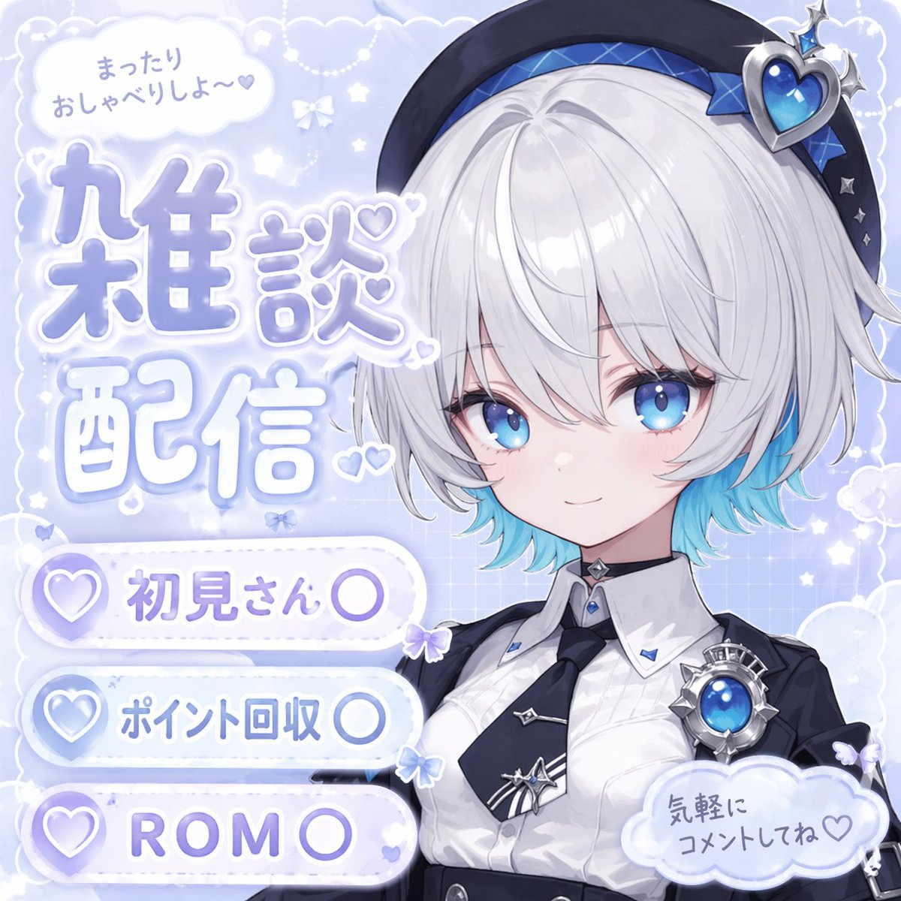</p>
- 来源仓库：`YouMind-OpenLab/awesome-gpt-image-2`
- 作者：[絵愛さやか🐸AIArtist](https://x.com/sayaka_aiart)
- [原链接](https://x.com/sayaka_aiart/status/2046176145075515600#reversed-1)

**Prompt**
```text
{
  "type": "anime-style livestream thumbnail",
  "character": {
    "hair": "{argument name=\"hair color\" default=\"short silver hair with cyan underlights\"}",
    "eyes": "large bright blue",
    "outfit": "white collared shirt, black tie with silver accents, black jacket, black beret with a large blue heart jewel, blue jewel brooch, black choker",
    "pose": "smiling gently, looking at viewer, positioned on the right side"
  },
  "background": "pastel blue with white clouds, sparkles, stars, small bows, and a subtle grid pattern",
  "typography_and_ui": {
    "top_left_speech_bubble": "まったりおしゃべりしよ〜♡",
    "main_title": {
      "text": "{argument name=\"main title\" default=\"雑談配信\"}",
      "style": "large, soft blue gradient, white outline, decorated with small hearts, positioned on the middle-left"
    },
    "bottom_left_badges": {
      "count": 3,
      "style": "white pill-sh...
```

### YouTube Thumbnail - Japanese Webinar Thumbnail Generator
<p></p>
- 来源仓库：`YouMind-OpenLab/awesome-gpt-image-2`
- 作者：[KAWAI](https://x.com/kawai_design)
- [原链接](https://x.com/kawai_design/status/2045408105136074800)

**Prompt**
```text
Create a high-quality Japanese {argument name="thumbnail type" default="webinar thumbnail"}. {argument name="aspect ratio" default="16:9 widescreen"}. There is a lot of text, but the main copy stands out clearly.
```

### YouTube Thumbnail - VTuber Debut Stream Thumbnail
<p></p>
- 来源仓库：`YouMind-OpenLab/awesome-gpt-image-2`
- 作者：[WTR](https://x.com/wtry1102)
- [原链接](https://x.com/wtry1102/status/2045270824542953673#reversed-1)

**Prompt**
```text
{
  "type": "VTuber debut stream thumbnail",
  "character": {
    "appearance": "anime girl, long dark purple hair, purple eyes, frilly white blouse, dark purple bow tie, large hair bow",
    "pose": "finger to lips, cute expression",
    "props": "condenser microphone with pop filter and purple ribbon on the right"
  },
  "background": "magical starry night, sparkles, glowing butterflies, purple and white color palette",
  "layout": {
    "typography": [
      {
        "position": "top left",
        "style": "large bold text with cursive English above",
        "text": "{argument name=\"main title\" default=\"初配信\"}",
        "subtext_1": "First Stream",
        "subtext_2": "Nice to meet you! I am Shisaki Lily!"
      },
      {
        "position": "middle left",
        "style": "decorative box",
        "text": "{argument name=\"character description\" default=\"お嬢様学校に通う清楚系VTuberです...
```

### YouTube Thumbnail - Gold &amp; Black Info-Product Thumbnail
<p></p>
- 来源仓库：`YouMind-OpenLab/awesome-gpt-image-2`
- 作者：[ナーガ@X女帝](https://x.com/naga_zyashin)
- [原链接](https://x.com/naga_zyashin/status/2045113428952678447#reversed-2)

**Prompt**
```text
{
  "type": "promotional banner / YouTube thumbnail",
  "style": "high contrast, flashy, professional, {argument name=\"theme color\" default=\"gold and black\"} palette, glowing light rays, sparkling particles",
  "subject": {
    "description": "{argument name=\"subject description\" default=\"confident young Asian man in a dark suit with arms crossed\"}",
    "pose": "looking upwards to the right",
    "props": "glowing open laptop in front of him"
  },
  "layout": {
    "background": "dark with radiant gold light bursts",
    "text_sections": {
      "top_left_badge": "[保存版]",
      "top_header": "{argument name=\"top text\" default=\"知識ゼロからでも今日から始められる！ AIで稼ぐ力を最短で手に入れる！\"}",
      "main_title": {
        "text": "{argument name=\"main title\" default=\"AI副業 完全攻略\"}",
        "style": "large, bold, 3D gold and white typography"
      },
      "subtitle_box": "{argument name=\"subtitle...
```

### YouTube Thumbnail - Neon AI Side Hustle YouTube Thumbnail
<p></p>
- 来源仓库：`YouMind-OpenLab/awesome-gpt-image-2`
- 作者：[ナーガ@X女帝](https://x.com/naga_zyashin)
- [原链接](https://x.com/naga_zyashin/status/2045113428952678447#reversed-1)

**Prompt**
```text
{
  "type": "promotional banner thumbnail",
  "style": "vibrant neon, cosmic galaxy background, anime illustration style, high-density Japanese typography, glowing text effects",
  "character": {
    "description": "smiling young woman pointing upwards with right index finger",
    "appearance": "long {argument name=\"character hair color\" default=\"brown\"} hair, purple drop earrings, textured purple sweater",
    "position": "right side"
  },
  "layout": {
    "background": "purple, pink, and blue starry space nebula",
    "center_typography": {
      "top_small_text": "何から始めるか迷う人へ",
      "main_title": "{argument name=\"main title\" default=\"初心者でもわかる AI副業\"}",
      "subtitle": "最初の1本におすすめ",
      "floating_text_near_character": "やさしく解説♡"
    },
    "top_left": {
      "yellow_ribbon": "{argument name=\"top left ribbon text\" default=\"ゼロから始める\"}"
    },
    "top_right": {
      "pi...
```

### YouTube Thumbnail - Neon Business Info-Product Thumbnail
<p></p>
- 来源仓库：`YouMind-OpenLab/awesome-gpt-image-2`
- 作者：[ナーガ@X女帝](https://x.com/naga_zyashin)
- [原链接](https://x.com/naga_zyashin/status/2045113428952678447#reversed-0)

**Prompt**
```text
{
  "type": "YouTube thumbnail",
  "style": "High-impact, neon green and black color scheme, cyber business aesthetic",
  "background": "Dark with glowing green grid, upward chart lines, large green arrow",
  "subject": {
    "description": "{argument name=\"subject description\" default=\"Serious Japanese man in a black suit\"}",
    "position": "Right side",
    "props": "Stacks of 10,000 Yen bills in bottom right"
  },
  "layout": {
    "main_title": {
      "text": "{argument name=\"main title\" default=\"月30万 ChatGPT副業 誰でも始めやすい\"}",
      "position": "Center, huge bold white and green gradient text"
    },
    "top_left_badge": {
      "text": "{argument name=\"top left badge\" default=\"再現性高め\"}",
      "style": "Angled neon green box"
    },
    "top_tags": {
      "count": 4,
      "labels": ["初心者OK", "スマホでも可能", "最短で収益化", "具体例つき"]
    },
    "left_bullet_points": {
      "count":...
```

### YouTube Thumbnail - Champions League Highlight Card Generator
<p>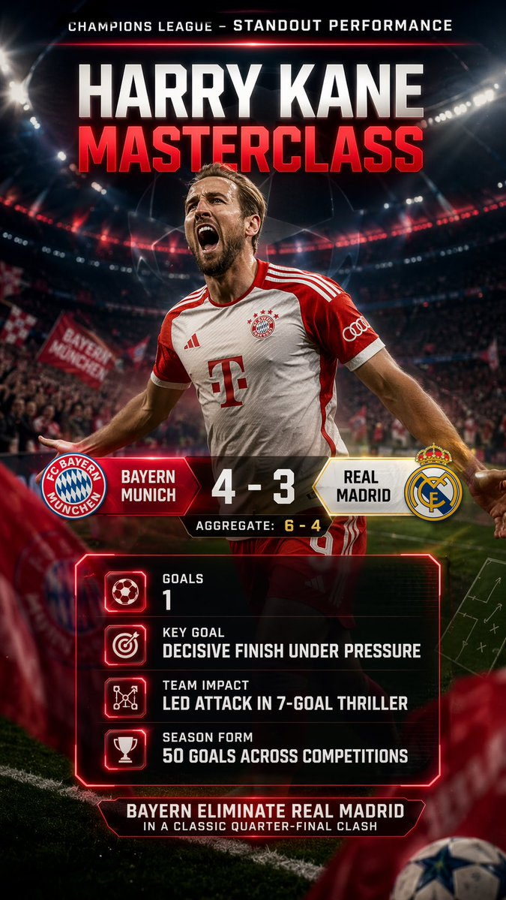</p>
- 来源仓库：`YouMind-OpenLab/awesome-gpt-image-2`
- 作者：[Alex Patrascu](https://x.com/maxescu)
- [原链接](https://x.com/maxescu/status/2045036186734039545)

**Prompt**
```text
Search the web for {argument name="performance description" default="this week’s standout individual performance in Champion’s League"}, using exact stats and game summary, {argument name="colors" default="bold team colors"}, legible score breakdown, and generate a {argument name="card type" default="Highlight card"}.
```

### YouTube Thumbnail - Classic Pianist Live Stream
<p></p>
- 来源仓库：`YouMind-OpenLab/awesome-gpt-image-2`
- 作者：[古♯出 陸](https://x.com/bowowwoaaa2)
- [原链接](https://x.com/bowowwoaaa2/status/2045032416876920974)

**Prompt**
```text
{argument name="pianist" default="Vladimir Horowitz"} performs a {argument name="event" default="live piano recital"} streamed on {argument name="platform" default="YouTube"}
```

### YouTube Thumbnail - YouTube Livestream Interface Mockup
<p></p>
- 来源仓库：`YouMind-OpenLab/awesome-gpt-image-2`
- 作者：[Marouane Lamharzi Alaoui](https://x.com/marouane53)
- [原链接](https://x.com/marouane53/status/2044946192203923493#reversed-0)

**Prompt**
```text
{
  "type": "YouTube livestream UI",
  "top_nav": {
    "logo": "YouTube Premium",
    "search": "{argument name=\"search query\" default=\"bilal fraiha\"}",
    "icons": 3
  },
  "player": {
    "subjects": [
      "{argument name=\"female guest\" default=\"Sydney Sweeney\"} in white cardigan",
      "bearded man in beige jacket laughing"
    ],
    "bg": "couch, 2 silver play buttons, ram logo 'SARDI'",
    "overlays": {
      "chat": {"pos": "left", "count": 15, "desc": "colored usernames, white text"},
      "goal": {"pos": "top right", "text": "TONIGHT'S GOAL: 0 to 25"},
      "banner": {"pos": "bottom center", "text": "K {argument name=\"streamer name\" default=\"MOREBILAL\"}"}
    },
    "controls": {"count": 10}
  },
  "details": {
    "title": "{argument name=\"video title\" default=\"FULL STREAM | سيدني سويني مع بلال\"}",
    "channel": "{argument name=\"channel name\" default=...
```

### YouTube Thumbnail - Anime VTuber Reaction Thumbnail
<p>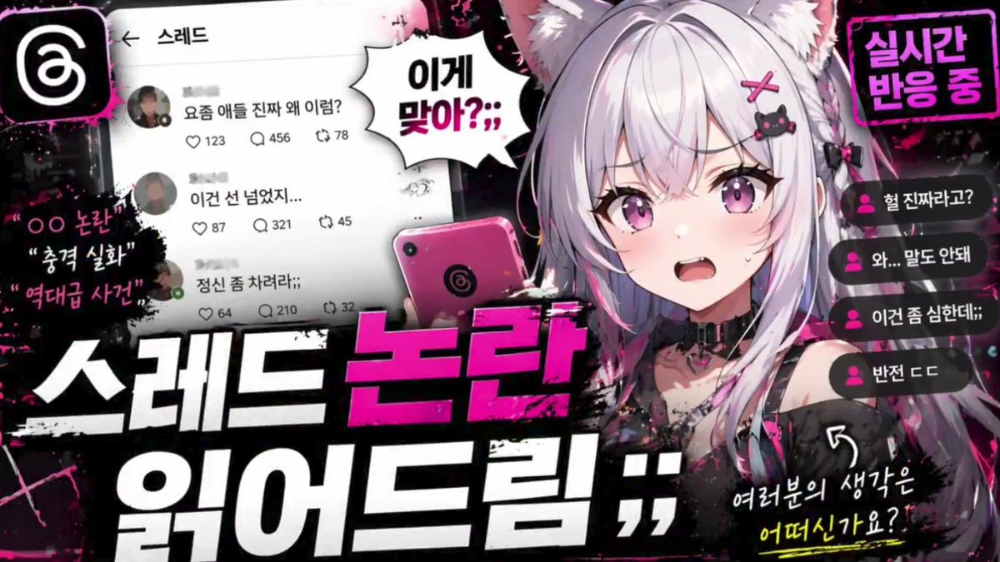</p>
- 来源仓库：`YouMind-OpenLab/awesome-gpt-image-2`
- 作者：[AJ - e/acc](https://x.com/abdiisan)
- [原链接](https://x.com/abdiisan/status/2044865935752708451#reversed-0)

**Prompt**
```text
{
  "type": "YouTube thumbnail graphic",
  "style": "anime, edgy, neon pink and black color scheme, grunge and splatter accents",
  "character": {
    "appearance": "anime girl, {argument name=\"hair color\" default=\"silver\"} hair, cat ears, purple eyes",
    "expression": "{argument name=\"expression\" default=\"shocked and sweating\"}, mouth open",
    "accessories": "black cat hairclip with pink cross, black choker with heart ring",
    "action": "holding a pink smartphone with a swirl logo"
  },
  "layout": {
    "main_title": {
      "position": "bottom center",
      "style": "huge, bold, 3D typography, grunge texture",
      "lines": [
        { "text": "{argument name=\"main title top\" default=\"스레드 논란\"}", "color": "neon pink" },
        { "text": "{argument name=\"main title bottom\" default=\"읽어드림 ;;\"}", "color": "white" }
      ]
    },
    "ui_elements": [
      {
      ...
```

### YouTube Thumbnail - YouTube Live Presentation UI Mockup
<p></p>
- 来源仓库：`YouMind-OpenLab/awesome-gpt-image-2`
- 作者：[Vi](https://x.com/tehno_maniak)
- [原链接](https://x.com/tehno_maniak/status/2044754985183785208#reversed-1)

**Prompt**
```text
{"type": "YouTube desktop dark mode UI mockup", "header": {"logo": "YouTube", "search_bar": "Search", "icons_count": 5, "icons": ["search", "mic", "create", "notifications", "profile"]}, "video_player": {"top_left_badge": "LIVE", "left_side": {"subject": "{argument name=\"presenter description\" default=\"man in green sweater at wooden podium\"}", "podium_logo": "OpenAI"}, "right_side_presentation": {"text_elements": ["OpenAI", "INTRODUCING", "{argument name=\"product name\" default=\"GPT-Image-2\"}", "{argument name=\"tagline\" default=\"More Realistic. More Useful. More Creative.\"}"], "sample_images_count": 4, "sample_images": ["mountain lake with boat", "woman portrait with dappled light", "cute robot with lantern in forest", "starry night cafe painting"]}, "bottom_controls_count": 10, "bottom_controls": ["pause", "next", "volume", "LIVE", "red progress bar", "CC", "settings", "minip...
```

### YouTube Thumbnail - True Crime Investigation Thumbnail
<p></p>
- 来源仓库：`YouMind-OpenLab/awesome-gpt-image-2`
- 作者：[Mirochill](https://x.com/mirochill)
- [原链接](https://x.com/mirochill/status/2044156286036590976#reversed-0)

**Prompt**
```text
A YouTube thumbnail-style collage for a {argument name="overall mood" default="dark, dramatic, true crime investigation"}. In the center is a highly detailed, close-up portrait of an {argument name="central figure" default="older man with grey hair and deep wrinkles resembling Jeffrey Epstein"}, wearing a black polo shirt, with a faint red glowing outline separating him from the background. On the left side, a {argument name="left background scene" default="tropical island with luxury villas and a flying airplane in a dark sky"}. Below the island, a conspiracy board motif features exactly 2 red push pins connected by 3 thick red strings. On the top right side, a hazy, sepia-toned depiction of the {argument name="right background scene" default="US Capitol building with the silhouettes of 3 men in suits facing it"}. On the bottom right, an open manila folder containing a {argument name="d...
```

### Comic / Storyboard - Dynamic Anime Warrior with Whip-Sword
<p></p>
- 来源仓库：`YouMind-OpenLab/awesome-gpt-image-2`
- 作者：[あーる@AI Artgrapher](https://x.com/REd8358)
- [原链接](https://x.com/REd8358/status/2046380070747644095#reversed-0)

**Prompt**
```text
A highly detailed anime illustration of a fierce female warrior with long flowing {argument name="hair color" default="black"} hair and piercing {argument name="eye color" default="blue"} eyes, wearing a mix of silver plate armor with gold trim and a {argument name="outfit color" default="blue and white"} tunic. She is captured in a dynamic combat stance, swinging a massive, {argument name="weapon type" default="segmented metallic whip-sword"} that curves dramatically into the extreme foreground. The weapon leaves a sweeping trail of kinetic energy and wind. The scene is set against a {argument name="background setting" default="ruined battlefield with rocky terrain, floating debris, and large blue banners fluttering in the wind"} under a dramatic cloudy sky. The artwork features cinematic lighting, intense action, and a dramatic forced perspective on the weapon.
```

### Comic / Storyboard - Satirical 4-Panel Caricature Comic Strip
<p>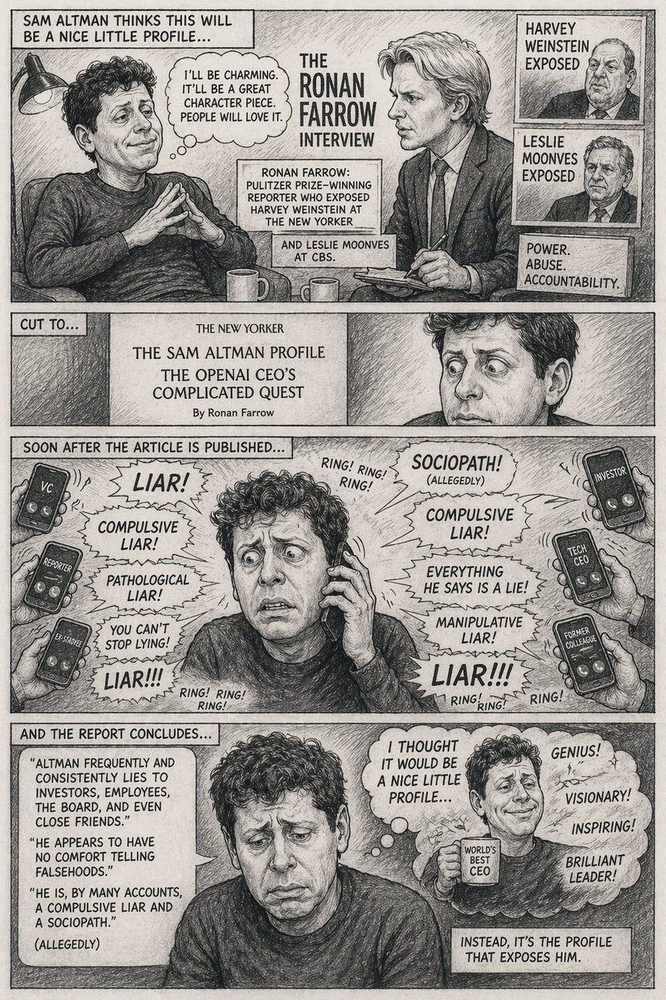</p>
- 来源仓库：`YouMind-OpenLab/awesome-gpt-image-2`
- 作者：[Kai](https://x.com/kaikaitheaiguy)
- [原链接](https://x.com/kaikaitheaiguy/status/2046348036394393677#reversed-1)

**Prompt**
```text
{
  "type": "4-panel vertical comic strip",
  "style": "{argument name=\"art style\" default=\"black and white pencil sketch, crosshatch shading, satirical caricature comic\"}",
  "characters": {
    "subject_1": "{argument name=\"main character\" default=\"Sam Altman\"}, curly hair, casual sweater",
    "subject_2": "{argument name=\"interviewer\" default=\"Ronan Farrow\"}, suit, tie, holding notepad"
  },
  "layout": {
    "panels": [
      {
        "panel_number": 1,
        "top_caption": "SAM ALTMAN THINKS THIS WILL BE A NICE LITTLE PROFILE...",
        "scene": "subject_1 looking smug with hands steepled; subject_2 looking serious taking notes.",
        "thought_bubble": "I'LL BE CHARMING. IT'LL BE A GREAT CHARACTER PIECE. PEOPLE WILL LOVE IT.",
        "center_text": "THE RONAN FARROW INTERVIEW",
        "inset_portraits": {
          "count": 2,
          "labels": ["HARVEY WEI...
```

### Comic / Storyboard - Two-Page Psychological Thriller Manga Spread
<p></p>
- 来源仓库：`YouMind-OpenLab/awesome-gpt-image-2`
- 作者：[おのふみ| 動画生成AI×ショート動画](https://x.com/onofumi_AI)
- [原链接](https://x.com/onofumi_AI/status/2046344973835231524#reversed-0)

**Prompt**
```text
{
  "type": "two-page manga spread",
  "style": "highly detailed realistic manga, monochrome, screentones, dramatic lighting, psychological thriller",
  "global_elements": {
    "protagonist": "{argument name=\"main character description\" default=\"young Japanese salaryman in a suit\"}",
    "theme": "{argument name=\"core concept\" default=\"surrounded by a massive crowd of identical clones of himself\"}"
  },
  "layout": {
    "left_page": {
      "type": "full page splash panel",
      "setting": "{argument name=\"setting\" default=\"Shibuya scramble crossing at night\"}",
      "visuals": "Protagonist standing alone in the center of the crossing, looking around in shock at a massive crowd where every single person is an exact clone of him.",
      "text_elements": [
        {"type": "manga title logo", "text": "{argument name=\"manga title\" default=\"俺だらけの街\"}"},
        {"type": "...
```

### Comic / Storyboard - Manga Spread: Fantasy Game Developer
<p>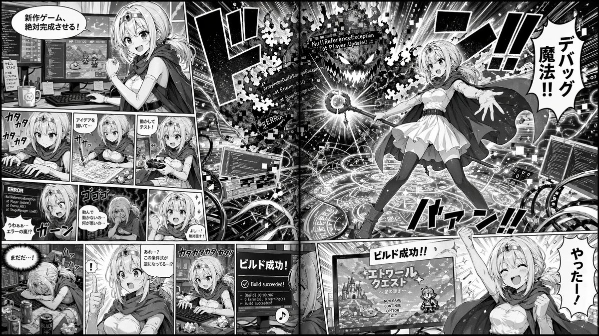</p>
- 来源仓库：`YouMind-OpenLab/awesome-gpt-image-2`
- 作者：[ち～ぽん✨🤔](https://x.com/gamemangaanime)
- [原链接](https://x.com/gamemangaanime/status/2046299699452506121#reversed-0)

**Prompt**
```text
{
  "type": "2-page manga spread",
  "style": "monochrome anime manga, screentones",
  "theme": "{argument name=\"main action\" default=\"fantasy mage developing a video game\"}",
  "character": "{argument name=\"character appearance\" default=\"anime girl with blonde hair, tiara, cape, white dress, thigh-highs\"}",
  "layout": {
    "left_page": {
      "panel_count": 11,
      "rows": [
        {"panels": 1, "action": "Determined at dual-monitor desk, speech bubble: '新作ゲーム、絶対完成させる！'"},
        {"panels": 3, "action": "Typing, drawing on tablet, testing with controller"},
        {"panels": 3, "action": "Shocked at ERROR screen, depressed, determined again"},
        {"panels": 4, "action": "Exhausted, sudden realization, furious typing, monitor showing 'Build succeeded!'"}
      ]
    },
    "right_page": {
      "panel_count": 2,
      "panels": [
        {"type": "large splash", "act...
```

### Comic / Storyboard - Elderly Yakuza Drawing Katana
<p>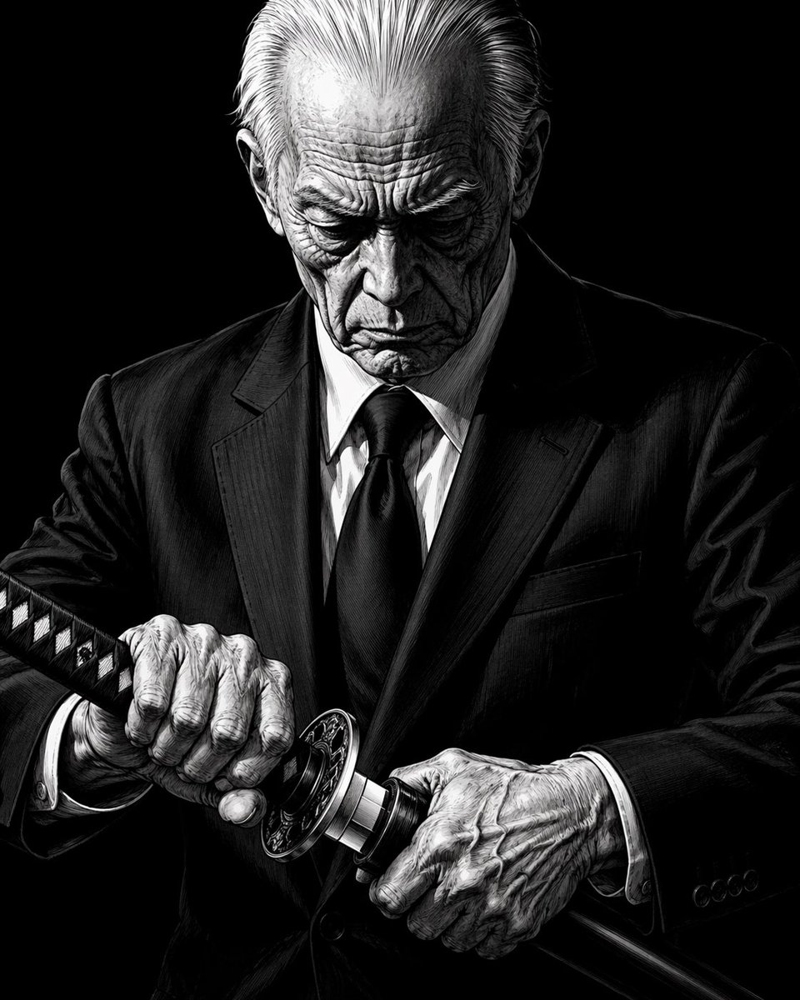</p>
- 来源仓库：`YouMind-OpenLab/awesome-gpt-image-2`
- 作者：[nic](https://x.com/nicdunz)
- [原链接](https://x.com/nicdunz/status/2046284007101390987#reversed-0)

**Prompt**
```text
A high-contrast, black-and-white illustration of an elderly man in a sharp suit, drawing a katana. The man has slicked-back white hair, deep wrinkles, and an intense, focused expression, looking down at the blade. He wears a dark suit, white shirt, and dark tie. His hands are prominently featured in the foreground, showing pronounced veins and wrinkles as they grip the ornate handle and scabbard of the katana. The background is completely black, emphasizing the dramatic lighting and intricate cross-hatching details on the man's face, hands, and clothing. The style resembles a detailed, gritty manga or graphic novel.
```

### Comic / Storyboard - Anime Movie Pitch Document with Poster and Settei
<p></p>
- 来源仓库：`YouMind-OpenLab/awesome-gpt-image-2`
- 作者：[いにしえ@AI Director & Creator｜Will Oldgram](https://x.com/old_pgmrs_will)
- [原链接](https://x.com/old_pgmrs_will/status/2046281827493748820#reversed-0)

**Prompt**
```text
{
  "type": "anime movie production pitch document",
  "overall_layout": "split layout with a large cinematic movie poster on the top half and a grid of 5 detailed reference sheets on the bottom half",
  "top_section": {
    "type": "movie poster",
    "visual": "A man, a woman, and a dog standing on a ruined city street, facing away from the viewer, looking towards a colossal, porous, web-like alien structure dominating the sky. A rusty 'RESTRICTED AREA' sign is on the right.",
    "typography": {
      "title": "{argument name=\"movie title\" default=\"劇場版 巨骸の向こう側 Fallen Colossus\"}",
      "release_date": "{argument name=\"release date\" default=\"2027.11.28 ROADSHOW\"}",
      "tagline": "そこにあるのは、まだ「説明」されていないもの。",
      "credits_studio": "{argument name=\"studio name\" default=\"WIT STUDIO\"}"
    }
  },
  "bottom_sections": [
    {
      "title": "{argument name=\"male character nam...
```

### Comic / Storyboard - Futuristic Corporate 3-Panel Manga Page
<p>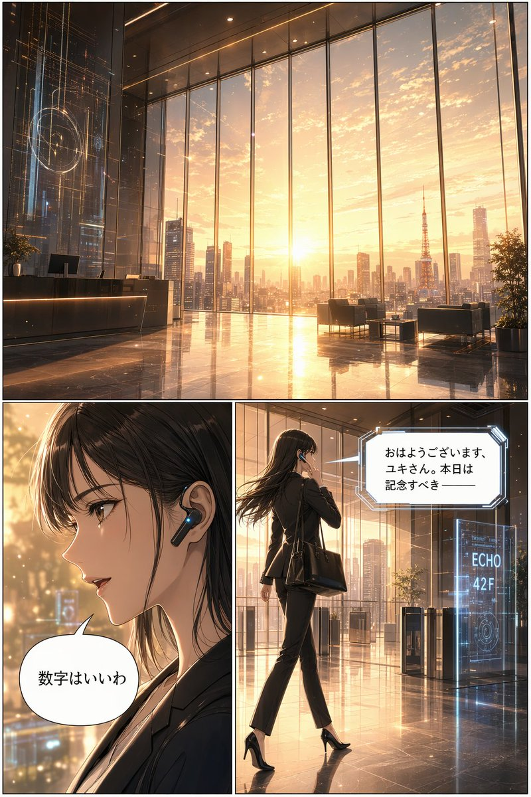</p>
- 来源仓库：`YouMind-OpenLab/awesome-gpt-image-2`
- 作者：[杉山浩二 ロイロCEO](https://x.com/loilokoji)
- [原链接](https://x.com/loilokoji/status/2046262205604417726#reversed-0)

**Prompt**
```text
{
  "type": "3-panel manga page",
  "style": "anime, highly detailed, cinematic lighting, futuristic corporate",
  "layout": {
    "structure": "1 wide top panel, 2 square bottom panels"
  },
  "panels": [
    {
      "position": "top",
      "shot": "wide landscape",
      "scene": "Futuristic corporate lobby with floor-to-ceiling windows",
      "lighting": "{argument name=\"time of day\" default=\"sunrise\"}",
      "background": "City skyline featuring {argument name=\"landmark\" default=\"Tokyo Tower\"}",
      "details": "Holographic displays, polished reflective floor, reception desk, lounge chairs"
    },
    {
      "position": "bottom left",
      "shot": "close-up profile",
      "character": "Young woman, dark hair, black business suit",
      "accessories": "Futuristic black earpiece with glowing blue light",
      "speech_bubble": {
        "style": "standard rounded",
    ...
```

### Comic / Storyboard - 4-Panel Parody Movie Poster Grid
<p></p>
- 来源仓库：`YouMind-OpenLab/awesome-gpt-image-2`
- 作者：[週末生成Lab｜PcNeko](https://x.com/pcneko_lab)
- [原链接](https://x.com/pcneko_lab/status/2046257786292769230#reversed-1)

**Prompt**
```text
{
  "type": "movie poster grid",
  "layout": "2x2 grid",
  "posters": [
    {
      "position": "top-left",
      "genre": "sci-fi comedy",
      "visuals": "A Japanese salaryman sitting on a crowded train looking nervous, flanked by two aliens in business attire: a green frog-like alien looking at a smartphone, and a blue octopus-like alien reading a newspaper.",
      "text_elements": {
        "tagline_top": "隣の席のアイツ、実は宇宙人でした。",
        "train_display": "次は 地球 (ちきゅう) Next Earth",
        "tagline_side": "この星の常識、いつの間にかアップデートされていた。",
        "main_title": "{argument name=\"poster 1 title\" default=\"となりの宇宙人\"}",
        "cast": "星野サダオ タコヤキ・Z カエルダ・X",
        "release_date": "6月13日(金) 全国公開"
      }
    },
    {
      "position": "top-right",
      "genre": "surreal romance",
      "visuals": "A man in a dark jacket affectionately hugging a giant onigiri (rice ball) topped with mentaiko (...
```

### Comic / Storyboard - Anime Character Reference Sheet
<p>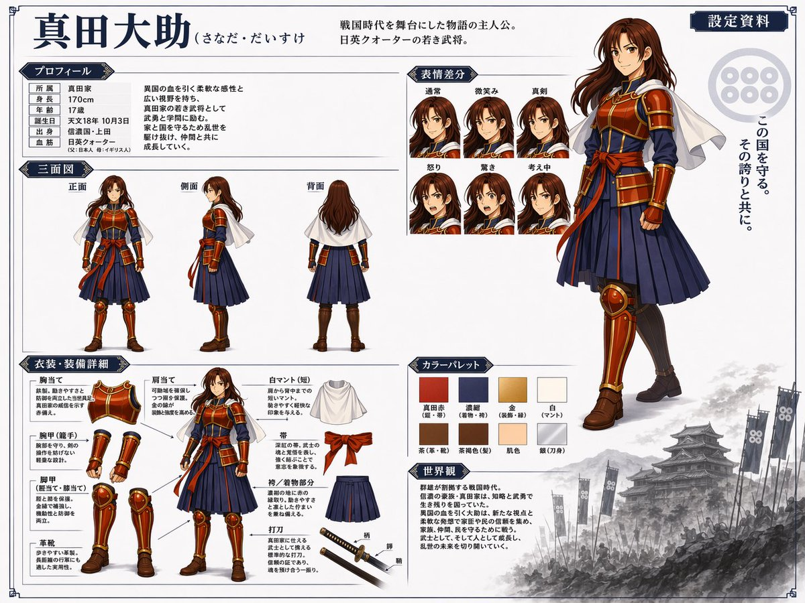</p>
- 来源仓库：`YouMind-OpenLab/awesome-gpt-image-2`
- 作者：[まこと＠らぶうね](https://x.com/Luvune)
- [原链接](https://x.com/Luvune/status/2046241739997098022#reversed-0)

**Prompt**
```text
{
  "type": "anime character reference sheet",
  "character": {
    "name": "{argument name=\"character name\" default=\"真田大助\"}",
    "appearance": "young warrior with long brown hair, wearing samurai-inspired armor, {argument name=\"main color\" default=\"red\"} chest plate and guards, {argument name=\"secondary color\" default=\"navy blue\"} pleated hakama, white short cape"
  },
  "layout": {
    "header": {
      "title": "{argument name=\"character name\" default=\"真田大助\"}",
      "subtitle": "{argument name=\"character concept\" default=\"戦国時代を舞台にした物語の主人公。日英クォーターの若き武将。\"}",
      "badge": "設定資料"
    },
    "right_side": {
      "main_portrait": "large full-body standing pose, confident smile",
      "background_elements": {
        "emblem": "six-coin crest",
        "quote": "{argument name=\"catchphrase\" default=\"この国を守る。その誇りと共に。\"}",
        "scenery": "monochrome Japanese cas...
```

### Comic / Storyboard - Anime Production Layout Sheet
<p></p>
- 来源仓库：`YouMind-OpenLab/awesome-gpt-image-2`
- 作者：[pozitiv4ik](https://x.com/Gc_qube)
- [原链接](https://x.com/Gc_qube/status/2046189202488881427#reversed-1)

**Prompt**
```text
{
  "type": "anime production layout sheet",
  "style": "traditional colored pencil genga, key animation drawing",
  "subject": {
    "character": "{argument name=\"character name\" default=\"ナズナ 七草\"}",
    "appearance": "anime girl with {argument name=\"hair color\" default=\"light purple\"} hair styled in twin braids and bangs, blue eyes, wearing a dark oversized coat",
    "pose_and_expression": "{argument name=\"expression\" default=\"smug with a small fang, resting chin on hand\"}"
  },
  "background": "{argument name=\"background scene\" default=\"nighttime city skyline with a railing\"}, soft focus",
  "layout": {
    "top_edge": "standard animation paper peg holes",
    "left_margin": {
      "series_title": "{argument name=\"anime title\" default=\"よふかしのうた\"}",
      "production_codes": ["#05 C.", "[A] (1)"],
      "circled_note": "髪のハイライト 色トレスです"
    },
    "right_margin": {
 ...
```

---

## 信息图 / Infographic
<a id="infographic"></a>

> 当前分类共 **19** 条

### 3D Stone Staircase Evolution Infographic
<p></p>
- 来源仓库：`YouMind-OpenLab/awesome-gpt-image-2`
- 作者：[知识猫图解](https://x.com/GeekCatX)
- [原链接](https://x.com/GeekCatX/status/2045792240044511277#reversed-1)

**Prompt**
```text
{
  "type": "evolutionary timeline infographic",
  "instruction": "Using REFERENCE_0 as a structural base, transform the flat vector design into a highly realistic 3D infographic. Replace the smooth ramps with distinct stone steps and upgrade all organisms to photorealistic 3D models.",
  "style": {
    "background": "{argument name=\"background style\" default=\"vintage textured parchment paper\"}",
    "staircase": "{argument name=\"staircase material\" default=\"realistic textured stone blocks\"}",
    "subjects": "{argument name=\"organism style\" default=\"highly detailed photorealistic 3D renders\"}"
  },
  "layout": {
    "main_title": "{argument name=\"main title\" default=\"人类演化\"}",
    "sections": [
      {
        "position": "left sidebar",
        "count": 8,
        "labels": ["L0: 单细胞生命", "L1: 多细胞生物", "L2: 动物界", "L3: 脊索动物", "L4: 上陆革命", "L5: 哺乳纲", "L6: 人科演化", "L7: 智人纪元"]
 ...
```

### Illustrated City Food Map
<p></p>
- 来源仓库：`YouMind-OpenLab/awesome-gpt-image-2`
- 作者：[皮皮特](https://x.com/mm_zzm44854)
- [原链接](https://x.com/mm_zzm44854/status/2045861258520568230#reversed-1)

**Prompt**
```text
{
  "type": "illustrated map infographic",
  "style": "{argument name=\"art style\" default=\"watercolor and ink hand-drawn illustration on vintage parchment\"}",
  "title_section": {
    "text": "{argument name=\"city name\" default=\"成都\"} {argument name=\"map title\" default=\"吃货暴走地图\"}",
    "mascot": "cartoon red chili pepper wearing sunglasses and giving a thumbs up"
  },
  "border": "{argument name=\"border decoration\" default=\"vine of green leaves and red chili peppers\"}",
  "layout": {
    "background": "textured beige parchment paper with yellow roads, blue rivers, and green park areas",
    "sections": [
      {
        "title": "landmarks",
        "count": 6,
        "illustrations": ["traditional pavilion", "traditional monastery", "modern skyscraper with climbing panda", "tall TV tower", "traditional gate", "industrial buildings"],
        "labels": ["人民公园", "文殊院", "IFS...
```

### Jingdezhen Blue-and-White Porcelain Diagram
<p></p>
- 来源仓库：`ZeroLu/awesome-gpt-image`
- [原链接](https://opennana.com/awesome-prompt-gallery/jingdezhen-blue-white-porcelain-diagram)

**Prompt**
```text
Generate a detailed explanatory diagram of Jingdezhen blue and white porcelain, accompanied by detailed Chinese knowledge analysis.
```

### Key Character Relationship Map
<p></p>
- 来源仓库：`ZeroLu/awesome-gpt-image`
- [原链接](https://opennana.com/awesome-prompt-gallery/key-character-relationship-map)

**Prompt**
```text
Please generate a key character relationship diagram for "XXX".
```

### Museum Catalog-Style Chinese Disassembly Infographic
<p></p>
- 来源仓库：`ZeroLu/awesome-gpt-image`
- [原链接](https://opennana.com/awesome-prompt-gallery/museum-level-chinese-disassembly-infographic)

**Prompt**
```text
Please automatically generate a "museum catalog-style Chinese disassembly infographic" based on the [Subject].

The entire image is required to combine a realistic main visual, structural disassembly, Chinese annotations, material descriptions, pattern meanings, color meanings, and core feature summaries. You need to automatically determine the most appropriate main subject, clothing system, artifact structure, era style, key components, material craftsmanship, color scheme, and layout structure based on the [Subject], and the user does not need to provide any other information.

The overall style should be: national museum exhibition boards, historical clothing catalogs, and cultural/museum thematic infographics, rather than ordinary posters, ancient-style portraits, e-commerce detail pages, or anime illustrations. The background uses paper textures such as off-white, silk white, and li...
```

### Momotaro Explainer Slide in Hybrid Style
<p></p>
- 来源仓库：`YouMind-OpenLab/awesome-gpt-image-2`
- 作者：[やまもん](https://x.com/yammamon)
- [原链接](https://x.com/yammamon/status/2045778624092254603)

**Prompt**
```text
Create an explanatory slide ({argument name="format" default="ponchi-e diagram"}) for {argument name="theme" default="Momotaro"} that fuses the gentle atmosphere of "Irasutoya" with the overwhelming information density of "Kasumigaseki slides".
```

### Profile / Avatar - Photorealistic Autumn Kimono Portrait
<p></p>
- 来源仓库：`YouMind-OpenLab/awesome-gpt-image-2`
- 作者：[Kazuma Endo](https://x.com/kazmaendo)
- [原链接](https://x.com/kazmaendo/status/2045446209532506159#reversed-0)

**Prompt**
```text
A {argument name="photography style" default="photorealistic portrait with shallow depth of field and soft bokeh"} of a {argument name="subject" default="young Japanese woman"} looking back over her shoulder at the camera with a {argument name="expression" default="gentle smile"}. She is wearing a {argument name="attire" default="light beige kimono with orange maple leaf patterns"} and a gold obi. Her dark hair is styled in an elegant updo with loose strands framing her face, and she wears small pearl earrings. The background features an {argument name="setting" default="autumn garden with vibrant red maple leaves"}, with bright red foliage framing the top left and a heavily blurred, soft background creating a serene, cinematic atmosphere.
```

### Social Media Post - Whiteboard Marker Anime Sketch
<p></p>
- 来源仓库：`YouMind-OpenLab/awesome-gpt-image-2`
- 作者：[nic](https://x.com/nicdunz)
- [原链接](https://x.com/nicdunz/status/2046328629873791075#reversed-0)

**Prompt**
```text
A realistic photograph of a whiteboard with a highly detailed {argument name="marker color" default="green"} dry-erase marker drawing of {argument name="subject" default="a samurai with a messy topknot and facial hair, hands clasped in prayer"}. The character is drawn in a {argument name="art style" default="detailed manga sketch"} style, shown in profile with eyes closed, wearing a traditional kimono with a katana tucked into his belt. To the left of the character, handwritten text in all-caps reads "{argument name="text line 1" default="VAGABOND"}" with "{argument name="text line 2" default="MUSASHI"}" written directly below it. The whiteboard has a glossy surface with realistic light reflections and glare on the left side, and a thin metallic frame is visible at the bottom edge, giving the impression of an authentic classroom or office environment.
```

### Social Media Post - 2x2 SNS School Banner Ad Grid
<p></p>
- 来源仓库：`YouMind-OpenLab/awesome-gpt-image-2`
- 作者：[パク🎈動画広告分析Pro × AI](https://x.com/masapark95)
- [原链接](https://x.com/masapark95/status/2046171479763828888#reversed-3)

**Prompt**
```text
{
  "type": "2x2 grid of banner advertisements",
  "theme": "{argument name=\"school name\" default=\"SNSスクール\"}",
  "target_audience": "{argument name=\"target audience\" default=\"学生\"}",
  "layout": {
    "grid": "2x2",
    "panels": [
      {
        "position": "top-left",
        "style": "dark neon, blue and purple",
        "subject": "young woman looking up hopefully, holding a smartphone, wearing a purple sweatshirt",
        "main_text": "{argument name=\"banner 1 headline\" default=\"SNSを仕事にしたい人へ\"}",
        "sub_text": "“好き”をカタチに。未来を変える一歩を、今。",
        "elements": [
          "white and yellow typography",
          "yellow call-to-action button: チェックする >",
          "hand-drawn neon accents (crown, stars, heart)"
        ]
      },
      {
        "position": "top-right",
        "style": "bright, pop, cyan and white",
        "subject": "young woman smiling directly at ca...
```

### Social Media Post - 2x2 Social Media Course Banner Ads
<p></p>
- 来源仓库：`YouMind-OpenLab/awesome-gpt-image-2`
- 作者：[パク🎈動画広告分析Pro × AI](https://x.com/masapark95)
- [原链接](https://x.com/masapark95/status/2046171479763828888#reversed-1)

**Prompt**
```text
{"type": "2x2 grid of promotional banner ads", "theme": "{argument name=\"course theme\" default=\"Social Media Content Creation School\"}", "panels": [{"position": "top-left", "color_palette": "light blue and pink pastel gradient", "subject": "young woman smiling, resting chin on hand, smartphone and ring light in foreground", "typography": {"headline": "{argument name=\"top left headline\" default=\"発信を仕事に変える SNSスクール\"}", "subheadings": ["好きが、私の未来になる！", "クリエイター志望歓迎！"]}, "layout_elements": {"bullet_points_count": 3, "call_to_action_button": "pink button labeled '無料体験 >'"}}, {"position": "top-right", "color_palette": "deep blue and cyan geometric", "subject": "young man looking intently at a professional camera on a tripod with a ring light", "typography": {"headline": "{argument name=\"top right headline\" default=\"魅せる投稿が学べる\"}", "subheadings": ["企画・撮影・運用サポート"]}, "layout_elements": {"c...
```

### Social Media Post - 9-Panel Self-Care Infographic Grid
<p></p>
- 来源仓库：`YouMind-OpenLab/awesome-gpt-image-2`
- 作者：[无限 LOOP](https://x.com/j_zou93)
- [原链接](https://x.com/j_zou93/status/2046169184493793370#reversed-2)

**Prompt**
```text
{"type":"infographic poster","style":"cute flat vector illustration, cozy, warm, soft shading, {argument name=\"color palette\" default=\"pastel Morandi colors, soft pinks, purples, and warm tones\"}","character":"{argument name=\"character description\" default=\"young woman with shoulder-length brown hair wearing a pinkish-purple shirt\"}","layout":{"structure":"4 rows, 3 columns. Top row is a merged header. Rows 2-4 contain 9 individual panels.","header":{"title":"{argument name=\"main title\" default=\"情绪不好了？\"}","subtitle":"{argument name=\"subtitle\" default=\"8个让你瞬间变好的方法\"}","sub_subtitle":"写给焦虑的你，快来看看","visual":"character hugging herself, surrounded by yellow sparkles and hearts"},"grid_panels":[{"id":1,"title":"1. 深呼吸","text":"调节神经，缓解紧张情绪。","visual":"character with eyes closed, smiling, surrounded by clouds"},{"id":2,"title":"2. 去户外散步","text":"接触自然，让心静下来。","visual":"character wa...
```

### Infographic / Edu Visual - Medical Infographic on Diabetes Progression
<p>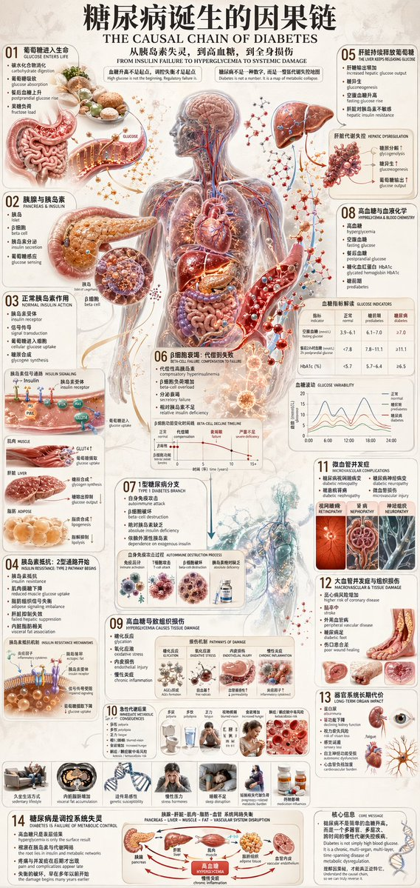</p>
- 来源仓库：`YouMind-OpenLab/awesome-gpt-image-2`
- 作者：[虎小象](https://x.com/hx831126)
- [原链接](https://x.com/hx831126/status/2046454226080219281#reversed-2)

**Prompt**
```text
{
  "type": "medical infographic poster",
  "style": "highly detailed anatomical illustrations, clean structured layout, scientific diagrammatic style",
  "color_palette": "{argument name=\"color palette\" default=\"medical red, blue, beige, and anatomical flesh tones\"}",
  "language": "{argument name=\"language\" default=\"bilingual Chinese and English\"}",
  "header": {
    "main_title": "{argument name=\"main title\" default=\"糖尿病诞生的因果链\"}",
    "english_title": "{argument name=\"english title\" default=\"THE CAUSAL CHAIN OF DIABETES\"}",
    "subtitle": "从胰岛素失灵，到高血糖，到全身损伤"
  },
  "layout": {
    "centerpiece": "{argument name=\"central subject\" default=\"transparent human body showing circulatory system and internal organs\"}",
    "sections_count": 14,
    "sections": [
      { "id": "01", "title": "葡萄糖进入生命", "visuals": ["stomach and intestines"] },
      { "id": "02", "title": "胰...
```

### Infographic / Edu Visual - Medical Infographic of Gout Pathology
<p></p>
- 来源仓库：`YouMind-OpenLab/awesome-gpt-image-2`
- 作者：[虎小象](https://x.com/hx831126)
- [原链接](https://x.com/hx831126/status/2046454226080219281#reversed-0)

**Prompt**
```text
{
  "type": "comprehensive medical infographic",
  "style": "highly detailed 3D medical illustration, clinical white background, clean typography",
  "header": {
    "title_cn": "{argument name=\"main title\" default=\"痛风诞生的因果链\"}",
    "title_en": "{argument name=\"english title\" default=\"THE CAUSAL CHAIN OF GOUT\"}",
    "subtitle": "Pain is not the beginning. Metabolic imbalance is.",
    "top_right_sequence": {
      "count": 6,
      "labels": ["Metabolism", "Transport", "Crystallization", "Immunity", "Inflammation", "Damage"]
    }
  },
  "centerpiece": {
    "description": "{argument name=\"central figure\" default=\"transparent anatomical human body showing liver, kidneys, and vascular system\"}",
    "details": "pathway highlighted in {argument name=\"highlight color\" default=\"glowing red\"} descending to the foot"
  },
  "layout": {
    "left_column": [
      { "id": "01", ...
```

### Infographic / Edu Visual - Scientific Optical Hardware Diagram
<p>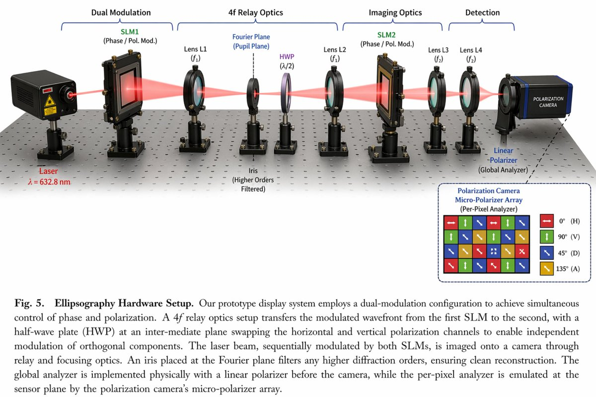</p>
- 来源仓库：`YouMind-OpenLab/awesome-gpt-image-2`
- 作者：[Lyra - e/acc](https://x.com/HumanOS_v2)
- [原链接](https://x.com/HumanOS_v2/status/2046317516297765219#reversed-0)

**Prompt**
```text
{
  "type": "scientific hardware diagram",
  "layout": {
    "main_scene": "3D render of an optical table with a red laser beam passing through 11 aligned optical components mounted on black posts.",
    "top_brackets": [
      {"label": "Dual Modulation", "span": "SLM1"},
      {"label": "4f Relay Optics", "span": "Lens L1 to Lens L2"},
      {"label": "Imaging Optics", "span": "SLM2 to Lens L4"},
      {"label": "Detection", "span": "Camera"}
    ],
    "optical_components_left_to_right": [
      {"name": "Laser", "labels": ["Laser", "λ = {argument name=\"laser wavelength\" default=\"632.8 nm\"}"]},
      {"name": "SLM1", "labels": ["SLM1", "(Phase / Pol. Mod.)"]},
      {"name": "Lens L1", "labels": ["Lens L1", "(f1)"]},
      {"name": "Iris", "labels": ["Fourier Plane", "(Pupil Plane)", "Iris", "(Higher Orders Filtered)"]},
      {"name": "HWP", "labels": ["HWP", "(λ/2)"]},
      {"n...
```

### Infographic / Edu Visual - Soccer Match Infographic Poster
<p></p>
- 来源仓库：`YouMind-OpenLab/awesome-gpt-image-2`
- 作者：[MCapital](https://x.com/NumeroBTC)
- [原链接](https://x.com/NumeroBTC/status/2046313506396574102#reversed-0)

**Prompt**
```text
{
  "type": "sports match infographic poster",
  "theme": "UEFA Champions League",
  "background": "dark blue and purple cosmic sky, glowing blue hexagonal lines, illuminated stadium reflecting on water at bottom",
  "header": {
    "logo": "UEFA Champions League",
    "title": "{argument name=\"stage\" default=\"HALBFINALE\"}",
    "subtitle": "DAS ZIEL: {argument name=\"location\" default=\"BUDAPEST 2026\"}",
    "venue": "PUSKÁS ARÉNA"
  },
  "matchup": {
    "player_left": "{argument name=\"team 1 player\" default=\"Harry Kane\"} in red FC Bayern kit",
    "player_right": "{argument name=\"team 2 player\" default=\"Ousmane Dembélé\"} in blue PSG kit",
    "center_logos": "FC Bayern München and Paris Saint-Germain with VS",
    "date_box": "calendar icon, MITTWOCH, {argument name=\"date\" default=\"06.05.2026\"}"
  },
  "facts_section": {
    "title": "FACTS",
    "count": 5,
    "ite...
```

### Comic / Storyboard - Saint Seiya Golden Saints Card Grid
<p></p>
- 来源仓库：`YouMind-OpenLab/awesome-gpt-image-2`
- 作者：[松果先森](https://x.com/songguoxiansen)
- [原链接](https://x.com/songguoxiansen/status/2046476566537080849)

**Prompt**
```text
Generate a 12-grid card image of the 12 Golden Saints from Saint Seiya, with each card featuring its corresponding Chinese name, 4 cards per row, in a 16:9 aspect ratio.
```

### Comic / Storyboard - Food Pun Therapy Session
<p></p>
- 来源仓库：`YouMind-OpenLab/awesome-gpt-image-2`
- 作者：[nic](https://x.com/nicdunz)
- [原链接](https://x.com/nicdunz/status/2046289143748301098#reversed-0)

**Prompt**
```text
A humorous 3D cartoon illustration of a therapy session in a cozy office. On the left, a {argument name="patient character" default="sad anthropomorphic avocado half missing its pit"} sits on a brown leather lounge chair, gesturing with its thin stick-like arms. A large speech bubble above it reads "{argument name="speech text" default="I just feel so empty inside"}". On the right, the therapist, an {argument name="therapist character" default="anthropomorphic silver spoon"}, sits in a green armchair, holding a yellow pencil and writing on a notepad labeled "NOTES". The room has warm lighting, a beige rug on a wooden floor, and a bookshelf with a tissue box and books, one titled "REFLECT LISTEN VALIDATE". On the left wall hangs a framed poster reading "{argument name="poster text" default="IT'S OKAY TO FEEL YOUR FEELINGS"}" with a small heart. On the right wall hangs a framed diploma rea...
```

### Comic / Storyboard - Dynamic Anime Magic Action Scene
<p>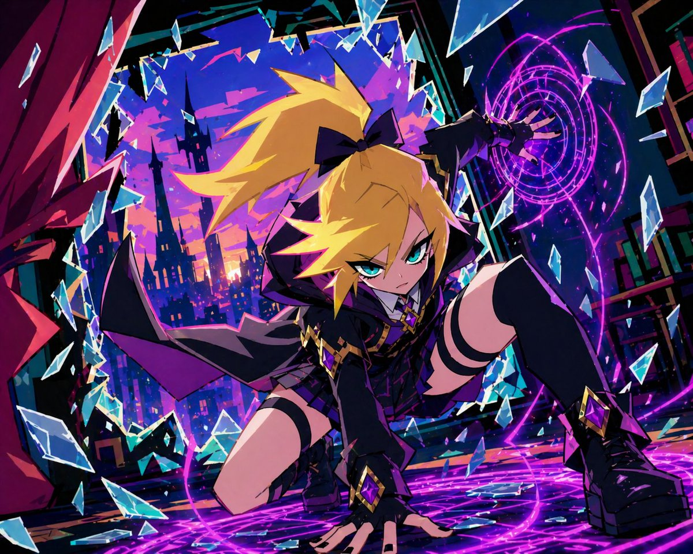</p>
- 来源仓库：`YouMind-OpenLab/awesome-gpt-image-2`
- 作者：[SHINTARO](https://x.com/UNIBRACITY)
- [原链接](https://x.com/UNIBRACITY/status/2046272561684873496#reversed-0)

**Prompt**
```text
A dynamic anime illustration of a girl with spiky {argument name="hair color" default="blonde"} hair tied in a high ponytail with a black bow, striking teal eyes, and a {argument name="outfit style" default="dark purple and black magical uniform with gold trim and diamond gems"}. She is in an intense crouching superhero landing pose, one hand pressed to the ground and the other raised, casting {argument name="magic color" default="glowing purple"} magic circles. She is shattering through a glass barrier, with sharp, jagged glass shards flying outward toward the viewer. Through the broken frame behind her, a {argument name="background scene" default="stylized silhouette of a gothic city with tall spires against a vibrant purple and orange sunset sky"} is visible. The artwork features {argument name="art style" default="sharp angles, high contrast cel-shading, and vibrant colors"}.
```

### Comic / Storyboard - Anime BBQ Girls Key Visual
<p></p>
- 来源仓库：`YouMind-OpenLab/awesome-gpt-image-2`
- 作者：[💐animaru_san](https://x.com/koshian_to)
- [原链接](https://x.com/koshian_to/status/2046200482885259736#reversed-0)

**Prompt**
```text
An anime-style key visual poster for a fictional slice-of-life anime. In the foreground left, an energetic blonde anime girl with star hairpins and blue eyes wears an {argument name="main character outfit" default="American flag t-shirt and denim shorts"}, holding tongs with a slice of smoked meat towards the viewer. In the foreground right, a gentle girl with long dark hair and a white sweater sits at a wooden table writing in a notebook. In the background, two more girls are present: one with a brown ponytail carrying firewood, and another with short silver hair holding a blue mug. The scene is a sunny outdoor BBQ area with a large black smoker grill featuring a sign that reads {argument name="background grill sign" default="LONE STAR BBQ"}. In the immediate foreground is a {argument name="food platter" default="massive wooden platter loaded with sliced brisket, ribs, sausages, burnt e...
```

---

## 游戏 / Character / Scene
<a id="game"></a>

> 当前分类共 **7** 条

### Anime Martial Arts Battle Illustration
<p></p>
- 来源仓库：`YouMind-OpenLab/awesome-gpt-image-2`
- 作者：[たねもみ 2.0 / Tanemomi Ver2.0](https://x.com/Tanemomi_Ver2)
- [原链接](https://x.com/Tanemomi_Ver2/status/2046063806846214265#reversed-0)

**Prompt**
```text
An anime-style illustration of a {argument name="action type" default="high-impact martial arts battle"} between two young female fighters in a {argument name="setting" default="traditional wooden martial arts dojo"}. In the foreground, a girl with black hair in a high bun wears a {argument name="character 1 color theme" default="red and white"} Chinese-style martial arts outfit with baggy pants. She is in a dynamic, low, forward-thrusting stance, surrounded by swirling red energy and water splashes. In the background to the right, a girl with light purple hair in twin buns wears a {argument name="character 2 color theme" default="green and purple"} Chinese dress with gold embroidery and black tights. She is leaping through the air in a flying kick pose, surrounded by swirling blue energy. The wooden floorboards are splintering from the intense impact, with debris and dust flying through...
```

### Official Character Reference Sheet
<p></p>
- 来源仓库：`ZeroLu/awesome-gpt-image`
- [原链接](https://opennana.com/awesome-prompt-gallery/official-character-reference-sheet)

**Prompt**
```text
Based on this character and background, please create a character reference sheet similar to official setting materials.
- Includes three-view drawings: front view, side view, and back view
- Add variations of the character's facial expressions
- Break down and display detailed parts of the clothing and equipment
- Add a color palette
- Include a brief explanation of the worldview setting
- Overall, use an organized layout (white background, illustration style)
```

### Profile / Avatar - Cosplay Selfie Prompt
<p>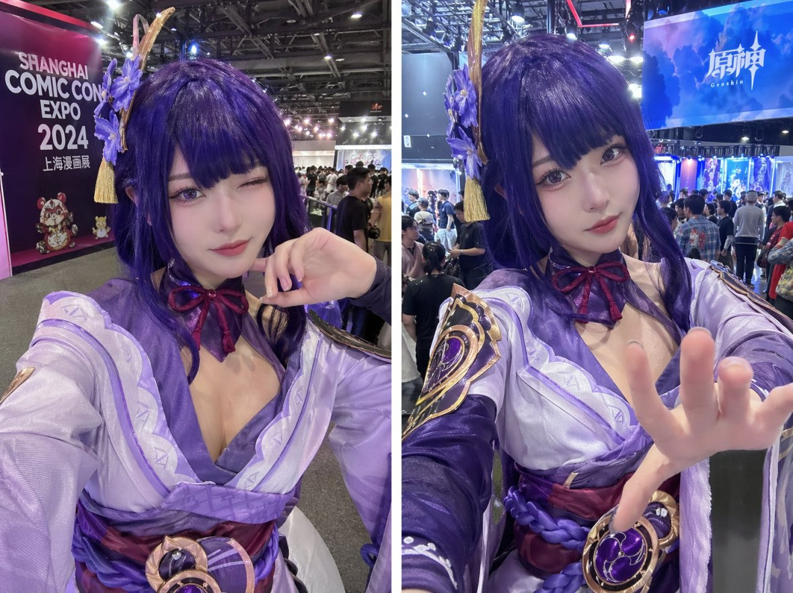</p>
- 来源仓库：`YouMind-OpenLab/awesome-gpt-image-2`
- 作者：[we we](https://x.com/wewe50770964683)
- [原链接](https://x.com/wewe50770964683/status/2046260217952997619)

**Prompt**
```text
Genshin Impact {argument name="character" default="Raiden Shogun"} cosplay selfies at the {argument name="event" default="Shanghai Comic Con"}
```

### Profile / Avatar - Idol Maid Polaroid Collection
<p></p>
- 来源仓库：`YouMind-OpenLab/awesome-gpt-image-2`
- 作者：[あねもん! (ex:anemone@AIArt)](https://x.com/anemone_sd)
- [原链接](https://x.com/anemone_sd/status/2046251166636622216#reversed-3)

**Prompt**
```text
{
  "type": "collection of instant photos",
  "setting": "laid out flat on a white fabric surface",
  "character": {
    "hair": "{argument name=\"hair color\" default=\"long pink hair with blue inner color\"}",
    "outfit": "{argument name=\"outfit\" default=\"black and white maid uniform with frilly headband and black ribbons\"}",
    "eyes": "reddish-pink"
  },
  "layout": {
    "arrangement": "two rows of five polaroid photos",
    "count": 10,
    "photos": [
      { "position": "top row 1", "description": "holding a pink heart cushion" },
      { "position": "top row 2", "description": "winking, making a peace sign" },
      { "position": "top row 3", "description": "making a hand heart, pink heart doodle on the bottom border" },
      { "position": "top row 4", "description": "resting chin on hands, gentle smile" },
      { "position": "top row 5", "description": "holding a red r...
```

### Profile / Avatar - Photorealistic Anime Schoolgirl Crouching Portrait
<p></p>
- 来源仓库：`YouMind-OpenLab/awesome-gpt-image-2`
- 作者：[kongo jun / 混合 順](https://x.com/jun_kongo)
- [原链接](https://x.com/jun_kongo/status/2046055289074630941#reversed-0)

**Prompt**
```text
A highly detailed, photorealistic anime-style portrait of a young woman crouching down and looking slightly down at the camera from a low angle. She has long, flowing {argument name="hair color" default="ash-blonde"} hair blowing gently in the wind, pale skin, and large, expressive eyes. She is wearing a {argument name="outfit" default="Japanese school uniform with a light grey cardigan, white shirt, dark plaid bow tie, dark plaid pleated skirt, dark knee-high socks, and black leather loafers"}. Her arms are resting casually on her knees. The background is a bright {argument name="sky condition" default="clear blue sky with scattered white clouds"}, with a blurred {argument name="background setting" default="chain-link fence and green trees"} visible at the very bottom, suggesting a schoolyard. The lighting is bright, natural daylight with soft, cinematic shadows, emphasizing the realist...
```

### Profile / Avatar - Mythological Character Avatar Grid
<p></p>
- 来源仓库：`YouMind-OpenLab/awesome-gpt-image-2`
- 作者：[wm](https://x.com/Ryan_Suo)
- [原链接](https://x.com/Ryan_Suo/status/2045555581487137125#reversed-0)

**Prompt**
```text
{
  "type": "character avatar grid",
  "theme": "{argument name=\"theme\" default=\"Journey to the West mythology\"}",
  "style": "{argument name=\"art style\" default=\"clean 2D cartoon vector illustration, thick outlines, flat colors\"}",
  "layout": {
    "background": "{argument name=\"background color\" default=\"light gray\"} subtle texture",
    "format": "grid of circular portraits with text labels centered below each circle",
    "rows": [
      {
        "count": 4,
        "items": [
          {"label": "Sun Wukong", "description": "monkey boy with golden headband and red scarf"},
          {"label": "Tang Sanzang", "description": "monk with ornate golden crown"},
          {"label": "Zhu Bajie", "description": "pig man holding a rake"},
          {"label": "Sha Wujing", "description": "bearded man holding a crescent moon staff"}
        ]
      },
      {
        "count": 4,
...
```

### Profile / Avatar - 3x3 Character Portrait Grid
<p></p>
- 来源仓库：`YouMind-OpenLab/awesome-gpt-image-2`
- 作者：[Nicolechan](https://x.com/stark_nico99)
- [原链接](https://x.com/stark_nico99/status/2045098289390051792#reversed-0)

**Prompt**
```text
{
  "type": "character portrait grid",
  "theme": "{argument name=\"theme\" default=\"Game of Thrones characters\"}",
  "style": "{argument name=\"art style\" default=\"2D flat illustration, clean line art, comic style, profile view facing right, pale skin with blush\"}",
  "layout": {
    "grid": "3x3",
    "background": "light gray textured",
    "frame_style": "white rounded-rectangle frames with text labels below each"
  },
  "count": 9,
  "portraits": [
    { "label": "Jon Snow", "description": "black hair half-up, beard, dark fur cloak" },
    { "label": "Daenerys Targaryen", "description": "silver braided hair, blue dress" },
    { "label": "Tyrion Lannister", "description": "curly brown hair, beard, dark tunic with gold pin" },
    { "label": "Cersei Lannister", "description": "blonde braided hair, ornate red and gold dress" },
    { "label": "Ned Stark", "description": "brown ha...
```

---

## 产品 / Product
<a id="product"></a>

> 当前分类共 **2** 条

### T-800 Taobao Product Detail Page
<p></p>
- 来源仓库：`ZeroLu/awesome-gpt-image`
- [原链接](https://opennana.com/awesome-prompt-gallery/terminator-taobao-page)

**Prompt**
```text
Generate image:
Taobao product detail page of a T-800 robot, showing:
front, side, and back three-view drawings of the robot,
product price,
product details,
functions and usage scenarios
```

### Social Media Post - Satirical 4-Panel Product Ads
<p>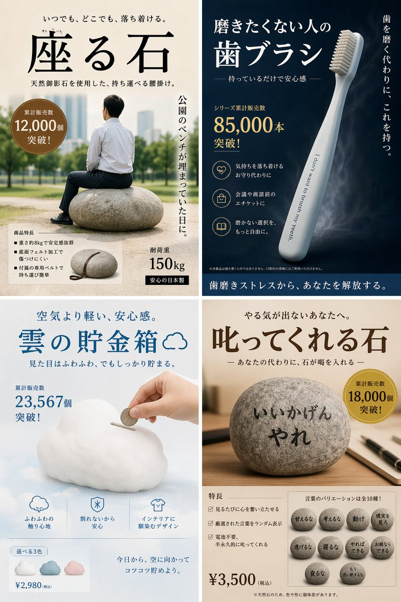</p>
- 来源仓库：`YouMind-OpenLab/awesome-gpt-image-2`
- 作者：[ふくみー｜人がすり減らない仕組みを設計する人](https://x.com/fukumy_ai)
- [原链接](https://x.com/fukumy_ai/status/2046292108668211324#reversed-0)

**Prompt**
```text
{
  "type": "4-panel satirical product advertisement grid",
  "layout": {
    "grid": "2x2",
    "panels": [
      {
        "position": "top-left",
        "product_name": "{argument name=\"top left product name\" default=\"座る石\"}",
        "visual": "man in white shirt and dark pants sitting on a large round stone in a park",
        "catchphrase": "いつでも、どこでも、落ち着ける。",
        "sales_badge": "累計販売数 12,000個 突破!",
        "vertical_text": "公園のベンチが埋まっていた日に。",
        "features_count": 3,
        "features_labels": [
          "重さ約8kgで安定感抜群",
          "底面フェルト加工で傷つけにくい",
          "付属の専用ベルトで持ち運び簡単"
        ],
        "extra_visual": "small inset image of the stone with a leather carrying strap",
        "specs": [
          "耐荷重 150kg",
          "安心の日本製"
        ]
      },
      {
        "position": "top-right",
        "product_name": "{argument name=\"top right product name\" default=\"...
```

---

## 人物 / Portrait
<a id="portrait"></a>

> 当前分类共 **6** 条

### Profile / Avatar - Personalized Minecraft Skin Prompt
<p></p>
- 来源仓库：`YouMind-OpenLab/awesome-gpt-image-2`
- 作者：[nic](https://x.com/nicdunz)
- [原链接](https://x.com/nicdunz/status/2046255350228058613)

**Prompt**
```text
create a minecraft skin inspired by {argument name="reference" default="my look"}
```

### Profile / Avatar - Vintage 35mm Flash Portrait
<p>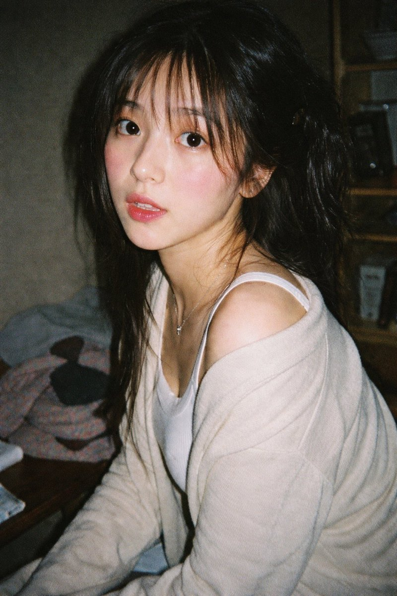</p>
- 来源仓库：`YouMind-OpenLab/awesome-gpt-image-2`
- 作者：[Ecoo](https://x.com/ecooai)
- [原链接](https://x.com/ecooai/status/2046254319163302131#reversed-0)

**Prompt**
```text
A vintage 35mm film photograph of a {argument name="subject description" default="young Asian woman"} with {argument name="hair style" default="long dark wavy hair and wispy bangs"}. She is wearing a {argument name="clothing" default="white ribbed tank top and a loose beige knit cardigan slipping off one shoulder"}, along with a delicate silver necklace. She has soft makeup with pink blush and glossy lips, looking directly at the camera with slightly parted lips. The lighting is harsh direct camera flash, creating a candid, amateur snapshot aesthetic. The background is a {argument name="setting" default="dimly lit, slightly messy room with clothes on a table and a wooden shelf"}. The image features heavy film grain, slightly muted colors, and a nostalgic, highly realistic photographic texture.
```

### Profile / Avatar - Custom Logo Basketball Selfie
<p></p>
- 来源仓库：`YouMind-OpenLab/awesome-gpt-image-2`
- 作者：[Mirochill](https://x.com/mirochill)
- [原链接](https://x.com/mirochill/status/2045437911395406111#reversed-0)

**Prompt**
```text
A photorealistic selfie of a young man with short wavy dark hair and light stubble on an indoor basketball court. He wears a black athletic t-shirt with a white swoosh. He holds a {argument name="ball color" default="green"} basketball featuring a large white {argument name="logo design" default="OpenAI logo"}. The background shows a hardwood floor, black wall pads, and a basketball hoop against a concrete wall. Bright indoor gym lighting with a casual social media aesthetic.
```

### Profile / Avatar - Historical Emperor Portrait Generation
<p></p>
- 来源仓库：`YouMind-OpenLab/awesome-gpt-image-2`
- 作者：[李岳](https://x.com/liyue_ai)
- [原链接](https://x.com/liyue_ai/status/2045071977279635962)

**Prompt**
```text
Generate avatars of various emperors from the {argument name="dynasty" default="Ming Dynasty"} based on the style of the uploaded image, with their posthumous names and personal names listed below the avatars.
```

### Profile / Avatar - Dramatic Wet Portrait Photography
<p></p>
- 来源仓库：`YouMind-OpenLab/awesome-gpt-image-2`
- 作者：[Ao Ye](https://x.com/AoYe999)
- [原链接](https://x.com/AoYe999/status/2045047980605190213#reversed-0)

**Prompt**
```text
A striking black and white close-up portrait of a {argument name="subject description" default="handsome young Asian man"} with {argument name="hair style" default="messy wet hair sticking to his forehead"}. His face and neck are glistening, covered in highly detailed {argument name="skin texture detail" default="water droplets and sweat"}. He has an intense, melancholic gaze directed off-camera to the left. The lighting is dramatic and high-contrast, emphasizing his sharp jawline, full lips, and specular highlights on the wet skin against a {argument name="background" default="pitch-black background"}. Shot in a photorealistic, high-fashion editorial style with cinematic chiaroscuro.
```

### Profile / Avatar - Backstage Cosplayer Portrait
<p></p>
- 来源仓库：`YouMind-OpenLab/awesome-gpt-image-2`
- 作者：[らけしで / Mizmic Studio](https://x.com/lakeside529)
- [原链接](https://x.com/lakeside529/status/2045033508062867821#reversed-0)

**Prompt**
```text
A highly detailed, realistic photograph of a young East Asian woman sitting in a cluttered backstage dressing room, getting ready for a cosplay event. She has {argument name="hair color" default="vibrant short red"} hair styled in a bob with bangs and is wearing an elaborate fantasy warrior costume featuring a {argument name="costume color" default="glossy red"} and gold tiered mini skirt, a white corset top with black lace and red lacing, matching glossy arm guards, and thigh-high boots. She is looking down with a focused expression, using her right hand to adjust the arm guard on her left arm. The vanity counter in front of her is messy, covered with makeup brushes, bottles, a hairbrush, and extra hairpieces. A large, ornate {argument name="prop" default="fantasy sword with a blue blade and gold hilt"} leans against the edge of the counter. The background shows a brightly lit vanity mi...
```

---

## 其他 / Other
<a id="other"></a>

> 当前分类共 **3** 条

### Handwritten Notebook Photo
<p></p>
- 来源仓库：`ZeroLu/awesome-gpt-image`
- [原链接](https://opennana.com/awesome-prompt-gallery/black-pen-handwritten-notes)

**Prompt**
```text
Amateur photo of an open notebook lying flat, filled with handwritten notes in black ballpoint pen. The handwriting is casual and slightly messy, like personnal notes, natural imperfections, crossed out words, underlined headings. Shot from slightly above, natural daylight from a window, no flash. Casual desk setting, shot on iPhone
```

### Social Media Post - Surreal Gothic Hall with Floating Masks
<p></p>
- 来源仓库：`YouMind-OpenLab/awesome-gpt-image-2`
- 作者：[のうめん🏗️👺生成AIパスポート認定取れた](https://x.com/nomen_machine)
- [原链接](https://x.com/nomen_machine/status/2046473998389977218#reversed-1)

**Prompt**
```text
A highly detailed, cinematic wide shot of a grand, dark gothic hall with a {argument name="atmosphere" default="dark fantasy"} aesthetic. In the center, a single figure wearing a {argument name="clothing" default="long white robe"} kneels on a highly reflective stone floor, facing an ornate golden altar illuminated by a row of lit candles. To the right of the kneeling figure, a single {argument name="floor object" default="wooden violin"} rests on the ground. The cavernous room is framed by massive dark stone pillars detailed with {argument name="accent color" default="glowing blue"} ethereal cracks and veins. Suspended from the high ceiling are dozens of {argument name="floating objects" default="white porcelain theatrical masks"} hanging on thin strings, filling the upper half of the space and creating a haunting, surreal atmosphere. The lighting is dramatic and moody, featuring a rich...
```

### Social Media Post - Goth Girl on Unicorn Ride
<p>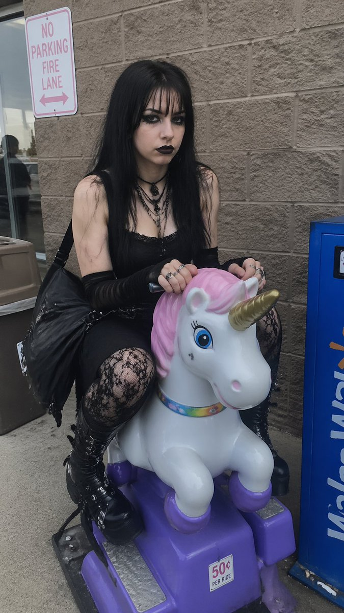</p>
- 来源仓库：`YouMind-OpenLab/awesome-gpt-image-2`
- 作者：[daniel.dmai](https://x.com/danieldmai)
- [原链接](https://x.com/danieldmai/status/2046263091873075429#reversed-0)

**Prompt**
```text
A candid, realistic photograph of a young {argument name="subject aesthetic" default="goth"} woman with pale skin, long straight black hair with bangs, heavy black eyeliner, and black lipstick. She has a {argument name="expression" default="deadpan"} expression, looking directly at the camera while sitting on a children's coin-operated {argument name="ride type" default="unicorn"} ride. She is wearing a black lace-trimmed tank top, black arm warmers, layered necklaces including a choker, black lace tights, and chunky black platform boots with buckles. A large black shoulder bag hangs from her arm. The ride is a white unicorn with a pink mane, gold horn, and purple hooves, mounted on a purple base with a small sticker reading "{argument name="ride cost" default="50¢ PER RIDE"}". The setting is outside a store with a tan cinderblock wall. To the left is a glass door reflecting a person, a ...
```

---
